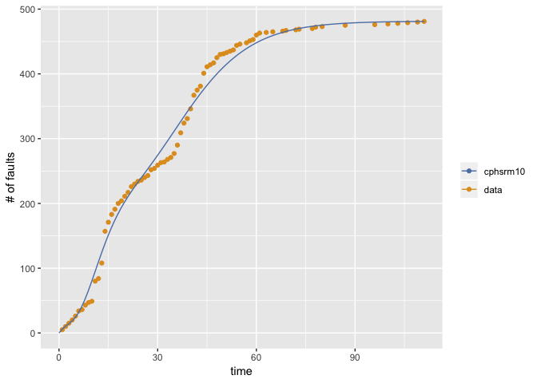
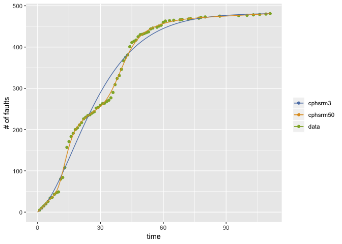
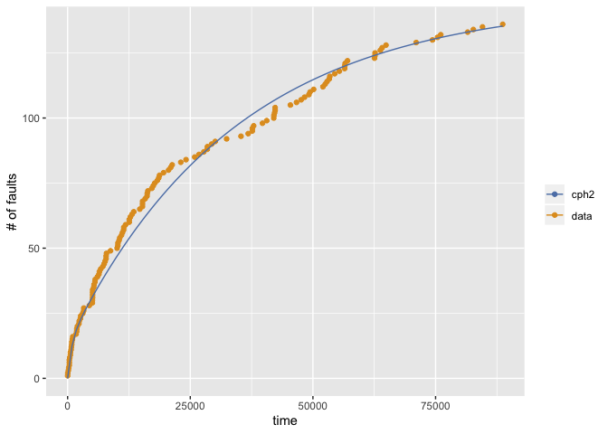
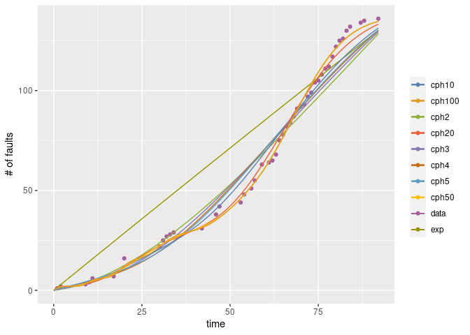

<!-- README.md is generated from README.Rmd. Please edit that file -->

# Rphsrm

Rphsrm provides the package to evalute the software reliability from the
fault data collected in the testing phase. Rphsrm uses two types of
data; fault-detection time data and its grouped data. The
fault-detection time data is a sequence of time intervals of fault
detection times (CPU time, etc). Also its grouped data is a sequence of
the number of detected faults for each time interval (per a working day,
per a week, etc). The reliability evaluation is based on the software
reliability growth model called PHSRM which is defined by NHPP
(non-homogeneous Poisson process) with phase-type fault-detection time
distribution.

## Installation

You can install Rsrat from github with:

``` r
# install.packages("devtools")
devtools::install_github("okamumu/Rphsrm")
```

## Example

This is an example of the estimation of software reliability growth
models from a fault data (tohma).

``` r
### load Rphsrm
library(Rphsrm)
#> Loading required package: Rsrat

### load example data that is included in Rsrat
data(dacs)

### tohma is a grouped data
tohma
#>   [1]  5  5  5  5  6  8  2  7  4  2 31  4 24 49 14 12  8  9  4  7  6  9  4
#>  [24]  4  2  4  3  9  2  5  4  1  4  3  6 13 19 15  7 15 21  8  6 20 10  3
#>  [47]  3  8  5  1  2  2  2  7  2  0  2  3  2  7  3  0  1  0  1  0  0  1  1
#>  [70]  0  0  1  1  0  0  0  1  2  0  1  0  0  0  0  0  0  2  0  0  0  0  0
#>  [93]  0  0  0  1  0  0  0  1  0  0  1  0  0  1  0  0  1  0  1

### Esimate all models and select the best one in terms of AIC
(result <- fit.srm.cph(fault=tohma))
#> Model name: cph10
#> [1]  481.4
#>  [1]  5.417e-01  2.451e-09  6.283e-17  1.631e-10  4.072e-01  8.353e-06
#>  [7]  3.749e-12  4.909e-11  2.505e-02  2.604e-02
#>  [1]  0.09431  0.16563  0.16583  0.16616  0.42404  0.42404  0.42404
#>  [8]  0.42404  0.45954  0.45969
#> Maximum LLF: -283.9308 
#> AIC: 607.8617 
#> Convergence: TRUE

### Draw the graph 
mvfplot(fault=tohma, mvf=list(result$srm))
```



The second example illustrates the estimation for the model with
user-specified phases

``` r
### Estimate two models and no select
(result <- fit.srm.cph(fault=tohma, phase=c(3, 50), selection=NULL))
#> $cph3
#> Model name: cph3
#> [1]  482.3
#> [1]  0.55974  0.36157  0.07869
#> [1]  0.08350  0.08619  0.08638
#> Maximum LLF: -315.7946 
#> AIC: 643.5892 
#> Convergence: TRUE 
#> 
#> 
#> $cph50
#> Model name: cph50
#> [1]  655.6
#>  [1]   2.899e-01   5.320e-02   1.408e-16   4.205e-18   2.741e-01
#>  [6]   3.122e-11   6.266e-33   4.155e-63   4.111e-94   3.094e-87
#> [11]   6.370e-80   2.366e-72   1.527e-64   1.983e-56   6.401e-38
#> [16]   7.162e-13   7.428e-02   3.817e-06   1.452e-20   2.012e-41
#> [21]   1.506e-61   8.640e-72   3.523e-65   1.921e-42   5.859e-15
#> [26]   2.450e-01   1.167e-08   6.774e-26   2.303e-50   1.906e-77
#> [31]  1.960e-101  6.835e-117  1.435e-118  6.529e-111   1.622e-91
#> [36]   9.007e-67   6.656e-42   2.738e-21   9.660e-08   3.505e-02
#> [41]   3.474e-03   3.331e-07   2.067e-10   5.327e-10   2.576e-06
#> [46]   8.168e-03   1.009e-02   4.261e-05   1.038e-05   6.665e-03
#>  [1]  0.001507  0.204578  0.204578  0.204578  0.701767  0.701767  0.701767
#>  [8]  0.701767  0.701767  0.701767  0.701767  0.701767  0.701767  0.701767
#> [15]  0.701767  0.701794  0.930807  0.930807  0.930807  0.930807  0.930811
#> [22]  0.930817  0.930827  0.930851  0.931146  1.814170  1.814170  1.814170
#> [29]  1.814170  1.814170  1.814170  1.814170  1.814170  1.814170  1.814183
#> [36]  1.814202  1.814228  1.814281  1.814852  1.962557  1.962903  1.962908
#> [43]  1.962940  1.962981  1.963099  1.981875  1.982883  1.982883  1.982883
#> [50]  1.996757
#> Maximum LLF: -227.324 
#> AIC: 654.6481 
#> Convergence: TRUE

### Draw the graph
mvfplot(fault=tohma, mvf=lapply(result, function(m) m$srm))
#> Warning: Removed 1 rows containing missing values (geom_path).
```



The third example shows the case where the fault data are fault
detection data.

``` r
### fault-detection time data
#### Time intervals for all faults
#### The last value is a negative value, that indicates the time interval in which there is no fault detection after the last fault detection.
sys1
#>   [1]     3    30   113    81   115     9     2    91   112    15   138
#>  [12]    50    77    24   108    88   670   120    26   114   325    55
#>  [23]   242    68   422   180    10  1146   600    15    36     4     0
#>  [34]     8   227    65   176    58   457   300    97   263   452   255
#>  [45]   197   193     6    79   816  1351   148    21   233   134   357
#>  [56]   193   236    31   369   748     0   232   330   365  1222   543
#>  [67]    10    16   529   379    44   129   810   290   300   529   281
#>  [78]   160   828  1011   445   296  1755  1064  1783   860   983   707
#>  [89]    33   868   724  2323  2930  1461   843    12   261  1800   865
#> [100]  1435    30   143   108     0  3110  1247   943   700   875   245
#> [111]   729  1897   447   386   446   122   990   948  1082    22    75
#> [122]   482  5509   100    10  1071   371   790  6150  3321  1045   648
#> [133]  5485  1160  1864  4116 -2526

### Esimate
(result <- fit.srm.cph(time=sys1[sys1>=0], te=-sys1[sys1<0]))
#> Model name: cph2
#> [1]  145
#> [1]  0.8891  0.1109
#> [1]  0.0000294  0.0013082
#> Maximum LLF: -968.369 
#> AIC: 1944.738 
#> Convergence: TRUE

### Draw the graph
mvfplot(time=sys1[sys1>=0], te=-sys1[sys1<0], mvf=list(result$srm))
```



The fourth example illustrates the case where the mvfs for all the
models are drawn.

``` r
### Esimate and return all the estimated results
(result <- fit.srm.cph(fault=sys1g, phase=c(1,2,3,4,5,10,20,50,100), selection=NULL))
#> Warning in emfit(srm, data, initialize = TRUE, maxiter = con$maxiter,
#> reltol = con$reltol, : Did not converge to MLE by max iteration.
#> $`cph1 (exp)`
#> Model name: exp
#>     omega       rate  
#> 4.295e+03  3.347e-04  
#> Maximum LLF: -192.5611 
#> AIC: 389.1221 
#> Convergence: FALSE 
#> 
#> 
#> $cph2
#> Model name: cph2
#> [1]  496.5
#> [1]  0.96253  0.03747
#> [1]  0.009743  0.010852
#> Maximum LLF: -180.7335 
#> AIC: 369.4671 
#> Convergence: TRUE 
#> 
#> 
#> $cph3
#> Model name: cph3
#> [1]  239.8
#> [1]  9.574e-01  7.648e-06  4.258e-02
#> [1]  0.02801  0.02813  0.03463
#> Maximum LLF: -178.1893 
#> AIC: 368.3787 
#> Convergence: TRUE 
#> 
#> 
#> $cph4
#> Model name: cph4
#> [1]  195.1
#> [1]  0.9384168  0.0005967  0.0057106  0.0552758
#> [1]  0.04810  0.04810  0.04821  0.04821
#> Maximum LLF: -176.9362 
#> AIC: 369.8724 
#> Convergence: TRUE 
#> 
#> 
#> $cph5
#> Model name: cph5
#> [1]  180.7
#> [1]  9.008e-01  9.162e-05  3.124e-04  6.259e-02  3.623e-02
#> [1]  0.06235  0.06235  0.06236  0.06505  0.06505
#> Maximum LLF: -176.0024 
#> AIC: 372.0048 
#> Convergence: TRUE 
#> 
#> 
#> $cph10
#> Model name: cph10
#> [1]  157
#>  [1]   8.421e-01   1.968e-31   4.432e-51   1.097e-45   1.828e-38
#>  [6]   1.451e-01   5.852e-05  3.742e-204  4.941e-324   1.272e-02
#>  [1]  0.1044  0.1044  0.1044  0.1044  0.1044  0.1721  0.1721  0.1721
#>  [9]  0.1721  0.9233
#> Maximum LLF: -169.5053 
#> AIC: 379.0107 
#> Convergence: TRUE 
#> 
#> 
#> $cph20
#> Model name: cph20
#> [1]  141.3
#>  [1]   7.830e-01   3.774e-06   1.393e-15   1.493e-27   1.592e-39
#>  [6]   5.836e-43   6.261e-37   1.282e-30   3.717e-24   1.274e-17
#> [11]   7.859e-06   1.559e-01   2.071e-04   5.992e-07   2.590e-02
#> [16]   2.085e-02   1.253e-55  3.918e-210  2.268e-278   1.412e-02
#>  [1]  0.2713  0.2713  0.2713  0.2713  0.2713  0.2713  0.2713  0.2713
#>  [9]  0.2713  0.2713  0.2713  0.2936  0.2936  0.2936  0.3027  0.3027
#> [17]  0.3027  0.3027  0.3027  0.9608
#> Maximum LLF: -162.3165 
#> AIC: 404.6329 
#> Convergence: TRUE 
#> 
#> 
#> $cph50
#> Model name: cph50
#> [1]  137.3
#>  [1]   6.053e-01   1.348e-03   2.197e-07   3.916e-11   1.077e-13
#>  [6]   4.304e-14   7.436e-12   1.173e-08   2.810e-04   1.759e-01
#> [11]   1.208e-03   6.801e-13   4.613e-31   1.399e-57   3.194e-65
#> [16]   3.985e-61   1.195e-56   5.793e-52   3.653e-47   2.551e-42
#> [21]   1.158e-09   1.009e-01   1.643e-17   9.943e-45   2.445e-68
#> [26]   1.754e-72   9.572e-52   4.414e-19   7.135e-02   3.839e-22
#> [31]   5.597e-77  1.656e-157  3.965e-237  6.630e-276  8.249e-244
#> [36]  6.632e-151   1.311e-48   2.907e-02   1.605e-55  2.410e-208
#> [41]  4.941e-324   0.000e+00   0.000e+00   0.000e+00   0.000e+00
#> [46]   0.000e+00  4.941e-324  3.957e-247   1.457e-02   2.109e-84
#>  [1]  0.4854  0.4854  0.4854  0.4854  0.4854  0.4854  0.4854  0.4854
#>  [9]  0.4856  0.5468  0.5468  0.5468  0.5468  0.5468  0.5468  0.5468
#> [17]  0.5468  0.5468  0.5468  0.5468  0.5473  0.6809  0.6809  0.6809
#> [25]  0.6809  0.6809  0.6809  0.6810  0.9015  0.9015  0.9015  0.9015
#> [33]  0.9016  0.9016  0.9016  0.9016  0.9016  1.1929  1.1929  1.1929
#> [41]  1.1929  1.1929  1.1929  1.1929  1.1929  1.1929  1.1929  1.1930
#> [49]  1.9432  1.9432
#> Maximum LLF: -157.15 
#> AIC: 514.3 
#> Convergence: TRUE 
#> 
#> 
#> $cph100
#> Model name: cph100
#> [1]  137.4
#>   [1]   6.223e-01   1.659e-04   1.914e-09   8.762e-14   2.155e-15
#>   [6]   8.506e-12   1.990e-07   1.661e-01   7.580e-06   4.041e-27
#>  [11]   2.034e-72  9.002e-143  3.863e-227  1.085e-297  2.721e-316
#>  [16]  1.289e-261  1.418e-155   2.212e-51   9.511e-02   4.443e-19
#>  [21]   1.321e-61  2.968e-130  2.808e-224  4.941e-324  4.941e-324
#>  [26]   0.000e+00   0.000e+00   0.000e+00   0.000e+00   0.000e+00
#>  [31]  4.941e-324  4.941e-324  1.181e-196   1.967e-94   6.975e-28
#>  [36]   7.269e-02   1.691e-11   1.957e-39   1.085e-85  5.396e-150
#>  [41]  7.003e-232  4.941e-324  4.941e-324  4.941e-324   0.000e+00
#>  [46]   0.000e+00   0.000e+00   0.000e+00   0.000e+00   0.000e+00
#>  [51]   0.000e+00   0.000e+00   0.000e+00   0.000e+00   0.000e+00
#>  [56]  4.941e-324  2.908e-242  8.563e-142   2.910e-67   3.362e-20
#>  [61]   2.913e-02   1.829e-08   2.427e-32   2.378e-74  4.537e-135
#>  [66]  3.164e-215  1.054e-315  4.941e-324  4.941e-324   0.000e+00
#>  [71]   0.000e+00   0.000e+00   0.000e+00   0.000e+00   0.000e+00
#>  [76]   0.000e+00   0.000e+00   0.000e+00   0.000e+00   0.000e+00
#>  [81]   0.000e+00   0.000e+00   0.000e+00   0.000e+00   0.000e+00
#>  [86]   0.000e+00   0.000e+00   0.000e+00   0.000e+00   0.000e+00
#>  [91]   0.000e+00  4.941e-324  1.045e-185   2.193e-74   1.127e-16
#>  [96]   1.456e-02   7.225e-13   1.032e-29   1.100e-42   1.686e-48
#>   [1]  0.3472  0.3472  0.3472  0.3472  0.3472  0.3472  0.3472  0.5371
#>   [9]  0.5375  0.5383  0.5393  0.5405  0.5420  0.5439  0.5461  0.5490
#>  [17]  0.5530  0.5623  1.5022  1.5022  1.5022  1.5023  1.5025  1.5027
#>  [25]  1.5029  1.5031  1.5033  1.5036  1.5038  1.5041  1.5045  1.5049
#>  [33]  1.5054  1.5062  1.5096  2.6552  2.6552  2.6552  2.6555  2.6559
#>  [41]  2.6563  2.6567  2.6571  2.6576  2.6581  2.6586  2.6591  2.6597
#>  [49]  2.6602  2.6608  2.6615  2.6621  2.6628  2.6636  2.6643  2.6652
#>  [57]  2.6662  2.6676  2.6712  2.7148  3.8977  3.8990  3.9006  3.9024
#>  [65]  3.9043  3.9063  3.9083  3.9104  3.9126  3.9148  3.9171  3.9195
#>  [73]  3.9219  3.9244  3.9270  3.9296  3.9323  3.9351  3.9379  3.9408
#>  [81]  3.9438  3.9468  3.9499  3.9531  3.9564  3.9598  3.9632  3.9668
#>  [89]  3.9705  3.9743  3.9784  3.9828  3.9882  3.9972  4.0604  4.8210
#>  [97]  4.8227  4.8251  4.8278  4.8307
#> Maximum LLF: -147.383 
#> AIC: 694.766 
#> Convergence: TRUE

### Draw the graph
mvfplot(fault=sys1g, mvf=lapply(result, function(x) x$srm))
#> Warning: Removed 1 rows containing missing values (geom_path).
```


