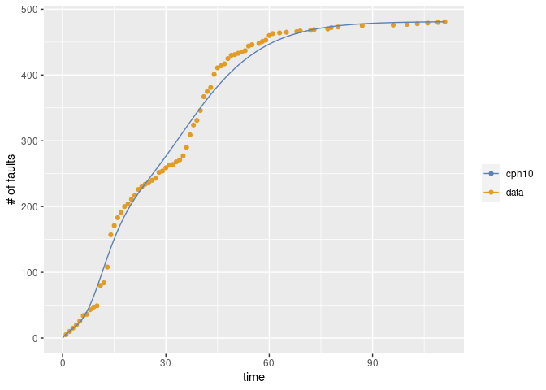

<!-- README.md is generated from README.Rmd. Please edit that file -->

# Rphsrm

Rphsrm provides the package to evalute the software reliability from the
fault data collected in the testing phase. Rphsrm uses two types of
data; fault-detection time data and its grouped data. The
fault-detection time data is a sequence of time intervals of fault
detection times (CPU time, etc). Also its grouped data is a sequence of
the number of detected faults for each time interval (per a working day,
per a week, etc). The reliability evaluation is based on the software
reliability growth model called PHSRM which is defined by NHPP
(non-homogeneous Poisson process) with phase-type fault-detection time
distribution.

  - Note: There are still some bugs.
  - TODO:
      - Remove a bug when the number of phases is 1 and 2.
      - Remove a bug when the data is given as time data.

## Installation

You can install Rsrat from github with:

``` r
# install.packages("devtools")
devtools::install_github("okamumu/Rphsrm")
```

## Example

This is an example of the estimation of software reliability growth
models from a fault data (tohma).

``` r
### require load librareis; Rsrat and Rphsrm
library(Rsrat)
library(Rphsrm)

### load example data
data(dacs)

### tohma is a grouped data
tohma
#>   [1]  5  5  5  5  6  8  2  7  4  2 31  4 24 49 14 12  8  9  4  7  6  9  4
#>  [24]  4  2  4  3  9  2  5  4  1  4  3  6 13 19 15  7 15 21  8  6 20 10  3
#>  [47]  3  8  5  1  2  2  2  7  2  0  2  3  2  7  3  0  1  0  1  0  0  1  1
#>  [70]  0  0  1  1  0  0  0  1  2  0  1  0  0  0  0  0  0  2  0  0  0  0  0
#>  [93]  0  0  0  1  0  0  0  1  0  0  1  0  0  1  0  0  1  0  1

### Esimate all models and select the best one in terms of AIC
(result <- fit.srm.cph(fault=tohma))
#> Error in em_cf1_emstep(res$param, data) : std::bad_alloc
#> Error in em_cf1_emstep(res$param, data) : std::bad_alloc
#> Error in em_cf1_emstep(res$param, data) : std::bad_alloc
#> Error in em_cf1_emstep(res$param, data) : std::bad_alloc
#> Error in em_cf1_emstep(res$param, data) : std::bad_alloc
#> Error in em_cf1_emstep(res$param, data) : std::bad_alloc
#> Error in em_cf1_emstep(res$param, data) : std::bad_alloc
#> Error in em_cf1_emstep(res$param, data) : std::bad_alloc
#> Error in em_cf1_emstep(res$param, data) : std::bad_alloc
#> Error in em_cf1_emstep(res$param, data) : std::bad_alloc
#> Error in em_cf1_emstep(res$param, data) : std::bad_alloc
#> Error in em_cf1_emstep(res$param, data) : std::bad_alloc
#> Error in em_cf1_emstep(res$param, data) : std::bad_alloc
#> Error in em_cf1_emstep(res$param, data) : std::bad_alloc
#> Error in em_cf1_emstep(res$param, data) : std::bad_alloc
#> Error in em_cf1_emstep(res$param, data) : std::bad_alloc
#> Error in em_cf1_emstep(res$param, data) : std::bad_alloc
#> Error in em_cf1_emstep(res$param, data) : std::bad_alloc
#> Error in em_cf1_emstep(res$param, data) : std::bad_alloc
#> Error in em_cf1_emstep(res$param, data) : std::bad_alloc
#> Error in em_cf1_emstep(res$param, data) : std::bad_alloc
#> Error in em_cf1_emstep(res$param, data) : std::bad_alloc
#> Error in em_cf1_emstep(res$param, data) : std::bad_alloc
#> Error in em_cf1_emstep(res$param, data) : std::bad_alloc
#> Error in em_cf1_emstep(res$param, data) : std::bad_alloc
#> Error in em_cf1_emstep(res$param, data) : std::bad_alloc
#> Error in em_cf1_emstep(res$param, data) : std::bad_alloc
#> Error in em_cf1_emstep(res$param, data) : std::bad_alloc
#> Error in em_cf1_emstep(res$param, data) : std::bad_alloc
#> Error in em_cf1_emstep(res$param, data) : std::bad_alloc
#> Error in em_cf1_emstep(res$param, data) : std::bad_alloc
#> Error in em_cf1_emstep(res$param, data) : std::bad_alloc
#> Error in em_cf1_emstep(res$param, data) : std::bad_alloc
#> Error in em_cf1_emstep(res$param, data) : std::bad_alloc
#> Error in em_cf1_emstep(res$param, data) : std::bad_alloc
#> Error in em_cf1_emstep(res$param, data) : std::bad_alloc
#> Error in em_cf1_emstep(res$param, data) : std::bad_alloc
#> Error in em_cf1_emstep(res$param, data) : std::bad_alloc
#> Error in em_cf1_emstep(res$param, data) : std::bad_alloc
#> Error in em_cf1_emstep(res$param, data) : std::bad_alloc
#> Error in em_cf1_emstep(res$param, data) : std::bad_alloc
#> Model name: cphsrm10
#> [1]  481.4
#>  [1]  5.290e-01  4.989e-09  2.796e-16  3.218e-15  3.218e-06  4.300e-01
#>  [7]  3.634e-06  2.869e-11  4.881e-07  4.097e-02
#>  [1]  0.09116  0.22059  0.22064  0.22069  0.22116  0.35833  0.35833
#>  [8]  0.35833  0.35833  0.37183
#> Maximum LLF: -285.7923 
#> AIC: 611.5846 
#> Convergence: TRUE

### Draw the graph 
mvfplot(fault=tohma, mvf=list(result$srm))
```



The second example illustrates the estimation for the model with
user-specified phases

``` r
### Estimate two models and no select
(result <- fit.srm.cph(fault=tohma, phase=c(3, 50), selection=NULL))
#> Error in em_cf1_emstep(res$param, data) : std::bad_alloc
#> $cphsrm3
#> Model name: cphsrm3
#> [1]  482.3
#> [1]  0.55976  0.36146  0.07878
#> [1]  0.08350  0.08629  0.08629
#> Maximum LLF: -315.7946 
#> AIC: 643.5892 
#> Convergence: TRUE 
#> 
#> 
#> $cphsrm50
#> Model name: cphsrm50
#> [1]  685.9
#>  [1]  3.214e-01  4.247e-02  9.070e-16  7.007e-40  1.467e-63  5.811e-75
#>  [7]  3.658e-67  3.795e-43  8.834e-16  2.676e-01  5.595e-08  3.263e-23
#> [13]  1.290e-45  2.699e-72  7.529e-85  5.004e-78  1.610e-70  1.170e-62
#> [19]  1.618e-54  4.350e-46  4.390e-37  2.367e-27  9.168e-18  4.906e-07
#> [25]  5.749e-02  4.094e-08  8.173e-26  1.623e-51  6.383e-69  4.113e-61
#> [31]  5.995e-53  1.220e-44  2.895e-36  6.880e-28  2.556e-01  2.337e-05
#> [37]  7.634e-41  4.584e-77  7.718e-75  1.555e-69  7.579e-64  5.263e-58
#> [43]  3.906e-52  2.323e-46  3.897e-02  7.198e-08  1.209e-29  8.032e-28
#> [49]  1.303e-02  3.449e-03
#>  [1]  0.001347  0.481076  0.481076  0.481076  0.481122  0.481349  0.481694
#>  [8]  0.482315  0.483943  0.931938  0.931938  0.931938  0.931938  0.931938
#> [15]  0.931938  0.931938  0.931938  0.931938  0.931938  0.931938  0.931938
#> [22]  0.931938  0.931938  0.931941  0.956523  0.956523  0.956523  0.956523
#> [29]  0.956523  0.956523  0.956523  0.956523  0.956523  0.956523  1.136959
#> [36]  1.136959  1.136959  1.136959  1.136959  1.136959  1.136959  1.136959
#> [43]  1.136959  1.136959  1.229719  1.229719  1.229719  1.229719  1.283495
#> [50]  1.283495
#> Maximum LLF: -231.76 
#> AIC: 663.5201 
#> Convergence: TRUE

### Draw the graph
mvfplot(fault=tohma, mvf=lapply(result, function(m) m$srm))
```


The third example shows the case where the fault data are fault
detection data.

``` r
### fault-detection time data
#### Time intervals for all faults
#### The last value is a negative value, that indicates the time interval in which there is no fault detection after the last fault detection.
sys1
#>   [1]     3    30   113    81   115     9     2    91   112    15   138
#>  [12]    50    77    24   108    88   670   120    26   114   325    55
#>  [23]   242    68   422   180    10  1146   600    15    36     4     0
#>  [34]     8   227    65   176    58   457   300    97   263   452   255
#>  [45]   197   193     6    79   816  1351   148    21   233   134   357
#>  [56]   193   236    31   369   748     0   232   330   365  1222   543
#>  [67]    10    16   529   379    44   129   810   290   300   529   281
#>  [78]   160   828  1011   445   296  1755  1064  1783   860   983   707
#>  [89]    33   868   724  2323  2930  1461   843    12   261  1800   865
#> [100]  1435    30   143   108     0  3110  1247   943   700   875   245
#> [111]   729  1897   447   386   446   122   990   948  1082    22    75
#> [122]   482  5509   100    10  1071   371   790  6150  3321  1045   648
#> [133]  5485  1160  1864  4116 -2526

### Esimate
(result <- fit.srm.cph(time=sys1[sys1>=0], te=-sys1[sys1<0]))
#> Error in em_cf1_emstep(res$param, data) : std::bad_alloc
#> Error in em_cf1_emstep(res$param, data) : std::bad_alloc
#> Error in em_cf1_emstep(res$param, data) : std::bad_alloc
#> Error in em_cf1_emstep(res$param, data) : std::bad_alloc
#> Error in em_cf1_emstep(res$param, data) : std::bad_alloc
#> Error in em_cf1_emstep(res$param, data) : std::bad_alloc
#> Error in em_cf1_emstep(res$param, data) : std::bad_alloc
#> Error in em_cf1_emstep(res$param, data) : std::bad_alloc
#> Error in em_cf1_emstep(res$param, data) : std::bad_alloc
#> Error in em_cf1_emstep(res$param, data) : std::bad_alloc
#> Error in em_cf1_emstep(res$param, data) : std::bad_alloc
#> Error in em_cf1_emstep(res$param, data) : std::bad_alloc
#> Error in em_cf1_emstep(res$param, data) : std::bad_alloc
#> Error in em_cf1_emstep(res$param, data) : std::bad_alloc
#> Error in em_cf1_emstep(res$param, data) : std::bad_alloc
#> Error in em_cf1_emstep(res$param, data) : std::bad_alloc
#> Error in em_cf1_emstep(res$param, data) : std::bad_alloc
#> Error in em_cf1_emstep(res$param, data) : std::bad_alloc
#> Error in em_cf1_emstep(res$param, data) : std::bad_alloc
#> Error in em_cf1_emstep(res$param, data) : std::bad_alloc
#> Error in em_cf1_emstep(res$param, data) : std::bad_alloc
#> Error in em_cf1_emstep(res$param, data) : std::bad_alloc
#> Error in em_cf1_emstep(res$param, data) : std::bad_alloc
#> Error in em_cf1_emstep(res$param, data) : std::bad_alloc
#> Error in em_cf1_emstep(res$param, data) : std::bad_alloc
#> Error in em_cf1_emstep(res$param, data) : std::bad_alloc
#> Error in em_cf1_emstep(res$param, data) : std::bad_alloc
#> Error in em_cf1_emstep(res$param, data) : std::bad_alloc
#> Error in em_cf1_emstep(res$param, data) : std::bad_alloc
#> Error in em_cf1_emstep(res$param, data) : std::bad_alloc
#> Error in em_cf1_emstep(res$param, data) : std::bad_alloc
#> Error in em_cf1_emstep(res$param, data) : std::bad_alloc
#> Error in em_cf1_emstep(res$param, data) : std::bad_alloc
#> Error in em_cf1_emstep(res$param, data) : std::bad_alloc
#> Error in em_cf1_emstep(res$param, data) : std::bad_alloc
#> Error in em_cf1_emstep(res$param, data) : std::bad_alloc
#> Warning in emfit(srm, data, initialize = TRUE, maxiter = con$maxiter,
#> reltol = con$reltol, : LLF becomes +-Inf, NaN or NA: cphsrm1 1
#> Error in em_cf1_emstep(res$param, data) : std::bad_alloc
#> Error in em_cf1_emstep(res$param, data) : std::bad_alloc
#> Error in em_cf1_emstep(res$param, data) : std::bad_alloc
#> Error in em_cf1_emstep(res$param, data) : std::bad_alloc
#> Warning in emfit(srm, data, initialize = TRUE, maxiter = con$maxiter,
#> reltol = con$reltol, : LLF becomes +-Inf, NaN or NA: cphsrm2 1
#> Error in em_cf1_emstep(res$param, data) : std::bad_alloc
#> Warning in emfit(srm, data, initialize = TRUE, maxiter = con$maxiter,
#> reltol = con$reltol, : LLF becomes +-Inf, NaN or NA: cphsrm3 1
#> Warning in emfit(srm, data, initialize = TRUE, maxiter = con$maxiter,
#> reltol = con$reltol, : LLF becomes +-Inf, NaN or NA: cphsrm4 1
#> Warning in emfit(srm, data, initialize = TRUE, maxiter = con$maxiter,
#> reltol = con$reltol, : LLF becomes +-Inf, NaN or NA: cphsrm5 1
#> Warning in emfit(srm, data, initialize = TRUE, maxiter = con$maxiter,
#> reltol = con$reltol, : LLF becomes +-Inf, NaN or NA: cphsrm6 1
#> Warning in emfit(srm, data, initialize = TRUE, maxiter = con$maxiter,
#> reltol = con$reltol, : LLF becomes +-Inf, NaN or NA: cphsrm7 1
#> Warning in emfit(srm, data, initialize = TRUE, maxiter = con$maxiter,
#> reltol = con$reltol, : LLF becomes +-Inf, NaN or NA: cphsrm8 1
#> Warning in emfit(srm, data, initialize = TRUE, maxiter = con$maxiter,
#> reltol = con$reltol, : LLF becomes +-Inf, NaN or NA: cphsrm9 1
#> Warning in emfit(srm, data, initialize = TRUE, maxiter = con$maxiter,
#> reltol = con$reltol, : LLF becomes +-Inf, NaN or NA: cphsrm10 1
#> Model name: cphsrm1
#> [1]  1
#> [1]  1
#> [1]  1
#> Maximum LLF: -Inf 
#> AIC: Inf 
#> Convergence: FALSE

### Draw the graph
mvfplot(time=sys1[sys1>=0], te=-sys1[sys1<0], mvf=list(result$srm))
```


The fourth example illustrates the case where the mvfs for all the
models are drawn.

``` r
### Esimate and return all the estimated results
(result <- fit.srm.cph(fault=sys1g, selection=NULL))
#> Error in em_cf1_emstep(res$param, data) : std::bad_alloc
#> Error in em_cf1_emstep(res$param, data) : std::bad_alloc
#> Error in em_cf1_emstep(res$param, data) : std::bad_alloc
#> Error in em_cf1_emstep(res$param, data) : std::bad_alloc
#> Error in em_cf1_emstep(res$param, data) : std::bad_alloc
#> Error in em_cf1_emstep(res$param, data) : std::bad_alloc
#> Error in em_cf1_emstep(res$param, data) : std::bad_alloc
#> Error in em_cf1_emstep(res$param, data) : std::bad_alloc
#> Error in em_cf1_emstep(res$param, data) : std::bad_alloc
#> Error in em_cf1_emstep(res$param, data) : std::bad_alloc
#> Error in em_cf1_emstep(res$param, data) : std::bad_alloc
#> Error in em_cf1_emstep(res$param, data) : std::bad_alloc
#> Error in em_cf1_emstep(res$param, data) : std::bad_alloc
#> Error in em_cf1_emstep(res$param, data) : std::bad_alloc
#> Error in em_cf1_emstep(res$param, data) : std::bad_alloc
#> Error in em_cf1_emstep(res$param, data) : std::bad_alloc
#> Error in em_cf1_emstep(res$param, data) : std::bad_alloc
#> Error in em_cf1_emstep(res$param, data) : std::bad_alloc
#> Error in em_cf1_emstep(res$param, data) : std::bad_alloc
#> Error in em_cf1_emstep(res$param, data) : std::bad_alloc
#> Error in em_cf1_emstep(res$param, data) : std::bad_alloc
#> Error in em_cf1_emstep(res$param, data) : std::bad_alloc
#> Error in em_cf1_emstep(res$param, data) : std::bad_alloc
#> Error in em_cf1_emstep(res$param, data) : std::bad_alloc
#> Error in em_cf1_emstep(res$param, data) : std::bad_alloc
#> Error in em_cf1_emstep(res$param, data) : std::bad_alloc
#> Error in em_cf1_emstep(res$param, data) : std::bad_alloc
#> Error in em_cf1_emstep(res$param, data) : std::bad_alloc
#> Error in em_cf1_emstep(res$param, data) : std::bad_alloc
#> Error in em_cf1_emstep(res$param, data) : std::bad_alloc
#> Error in em_cf1_emstep(res$param, data) : std::bad_alloc
#> Error in em_cf1_emstep(res$param, data) : std::bad_alloc
#> Error in em_cf1_emstep(res$param, data) : std::bad_alloc
#> Error in em_cf1_emstep(res$param, data) : std::bad_alloc
#> Error in em_cf1_emstep(res$param, data) : std::bad_alloc
#> Error in em_cf1_emstep(res$param, data) : std::bad_alloc
#> Warning in emfit(srm, data, initialize = TRUE, maxiter = con$maxiter,
#> reltol = con$reltol, : Did not converge to MLE by max iteration.
#> Error in em_cf1_emstep(res$param, data) : std::bad_alloc
#> Error in em_cf1_emstep(res$param, data) : std::bad_alloc
#> $cphsrm1
#> Model name: cphsrm1
#> [1]  4294
#> [1]  1
#> [1]  0.0003347
#> Maximum LLF: -192.5611 
#> AIC: 389.1222 
#> Convergence: FALSE 
#> 
#> 
#> $cphsrm2
#> Model name: cphsrm2
#> [1]  492.8
#> [1]  0.96078  0.03922
#> [1]  0.01025  0.01042
#> Maximum LLF: -180.7328 
#> AIC: 369.4656 
#> Convergence: TRUE 
#> 
#> 
#> $cphsrm3
#> Model name: cphsrm3
#> [1]  239.8
#> [1]  9.573e-01  1.795e-06  4.269e-02
#> [1]  0.02811  0.02811  0.03452
#> Maximum LLF: -178.1894 
#> AIC: 368.3788 
#> Convergence: TRUE 
#> 
#> 
#> $cphsrm4
#> Model name: cphsrm4
#> [1]  195.1
#> [1]  0.9384832  0.0005886  0.0056087  0.0553195
#> [1]  0.04812  0.04812  0.04820  0.04820
#> Maximum LLF: -176.9362 
#> AIC: 369.8724 
#> Convergence: TRUE 
#> 
#> 
#> $cphsrm5
#> Model name: cphsrm5
#> [1]  180.7
#> [1]  0.9007864  0.0001054  0.0002741  0.0626058  0.0362283
#> [1]  0.06236  0.06236  0.06236  0.06504  0.06504
#> Maximum LLF: -176.0024 
#> AIC: 372.0048 
#> Convergence: TRUE 
#> 
#> 
#> $cphsrm6
#> Model name: cphsrm6
#> [1]  174.4
#> [1]  8.719e-01  9.424e-09  2.113e-13  1.018e-01  7.350e-06  2.627e-02
#> [1]  0.06354  0.06354  0.06354  0.09615  0.09615  0.10365
#> Maximum LLF: -174.8969 
#> AIC: 373.7937 
#> Convergence: TRUE 
#> 
#> 
#> $cphsrm7
#> Model name: cphsrm7
#> [1]  165.9
#> [1]  8.623e-01  2.252e-05  9.568e-10  2.058e-07  1.166e-01  1.100e-14
#> [7]  2.102e-02
#> [1]  0.08331  0.08331  0.08331  0.08331  0.10570  0.10570  0.12853
#> Maximum LLF: -173.5188 
#> AIC: 375.0377 
#> Convergence: TRUE 
#> 
#> 
#> $cphsrm8
#> Model name: cphsrm8
#> [1]  160.1
#> [1]  8.486e-01  6.440e-06  1.235e-11  2.353e-11  2.922e-03  1.284e-01
#> [7]  1.196e-30  2.004e-02
#> [1]  0.1056  0.1056  0.1056  0.1056  0.1066  0.1091  0.1091  0.1353
#> Maximum LLF: -172.4189 
#> AIC: 376.8378 
#> Convergence: TRUE 
#> 
#> 
#> $cphsrm9
#> Model name: cphsrm9
#> [1]  159.3
#> [1]   8.459e-01   1.648e-16   4.042e-38   2.155e-43   7.870e-23   1.417e-01
#> [7]   7.908e-58  1.324e-225   1.242e-02
#> [1]  0.1046  0.1046  0.1046  0.1046  0.1046  0.1263  0.1263  0.1263  0.7854
#> Maximum LLF: -170.6897 
#> AIC: 377.3794 
#> Convergence: TRUE 
#> 
#> 
#> $cphsrm10
#> Model name: cphsrm10
#> [1]  157
#>  [1]   8.421e-01   1.821e-31   4.521e-51   1.115e-45   1.858e-38
#>  [6]   1.451e-01   5.890e-05  1.928e-204  4.941e-324   1.272e-02
#>  [1]  0.1044  0.1044  0.1044  0.1044  0.1044  0.1721  0.1721  0.1721
#>  [9]  0.1721  0.9233
#> Maximum LLF: -169.5053 
#> AIC: 379.0107 
#> Convergence: TRUE

### Draw the graph
mvfplot(fault=sys1g, mvf=lapply(result, function(x) x$srm))
#> Warning: Removed 1 rows containing missing values (geom_path).
#> Warning: Removed 1 rows containing missing values (geom_path).

#> Warning: Removed 1 rows containing missing values (geom_path).

#> Warning: Removed 1 rows containing missing values (geom_path).
```


