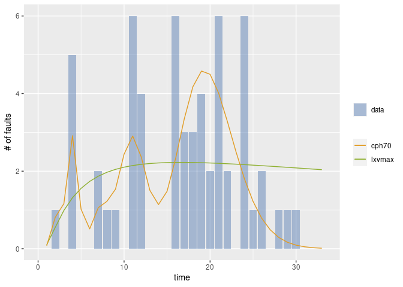

<!-- README.md is generated from README.Rmd. Please edit that file -->

# Rphsrm

Rphsrm provides the package to evalute the software reliability from the
fault data collected in the testing phase. Rphsrm uses two types of
data; fault-detection time data and its grouped data. The
fault-detection time data is a sequence of time intervals of fault
detection times (CPU time, etc). Also its grouped data is a sequence of
the number of detected faults for each time interval (per a working day,
per a week, etc). The reliability evaluation is based on the software
reliability growth model called PHSRM which is defined by NHPP
(non-homogeneous Poisson process) with phase-type fault-detection time
distribution.

## Installation

You can install Rphsrm from GitHub with:

``` r
install.packages("devtools")
devtools::install_github("SwReliab/Rphsrm")
```

Alternatively, you can install Rphsrm with remote:

``` r
install.packages("remotes")
remotes::install_github("SwReliab/Rphsrm")
```

## Example

This is an example of the estimation of software reliability growth
models from a fault data (tohma).

``` r
### load Rphsrm
library(Rphsrm)
#> Loading required package: Rsrat

### load example data that is included in Rsrat
data(dacs)

### tohma is a grouped data
tohma
#>   [1]  5  5  5  5  6  8  2  7  4  2 31  4 24 49 14 12  8  9  4  7  6  9  4  4  2
#>  [26]  4  3  9  2  5  4  1  4  3  6 13 19 15  7 15 21  8  6 20 10  3  3  8  5  1
#>  [51]  2  2  2  7  2  0  2  3  2  7  3  0  1  0  1  0  0  1  1  0  0  1  1  0  0
#>  [76]  0  1  2  0  1  0  0  0  0  0  0  2  0  0  0  0  0  0  0  0  1  0  0  0  1
#> [101]  0  0  1  0  0  1  0  0  1  0  1

### Esimate all models and select the best one in terms of AIC
(result <- fit.srm.cph(fault=tohma))
#> Model name: cph10
#> [1]  481.4
#>  [1]  5.417e-01  2.451e-09  6.283e-17  1.631e-10  4.072e-01  8.353e-06
#>  [7]  3.749e-12  4.909e-11  2.505e-02  2.604e-02
#>  [1]  0.09431  0.16563  0.16583  0.16616  0.42404  0.42404  0.42404  0.42404
#>  [9]  0.45954  0.45969
#> Maximum LLF: -283.9308 
#> AIC: 607.8617 
#> Convergence: TRUE

### Draw the graph 
mvfplot(fault=tohma, srms=result)
```


The second example illustrates the estimation for the model with
user-specified phases

``` r
### Estimate two models and no select
(result <- fit.srm.cph(fault=tohma, phase=c(3, 50), selection=NULL))
#> $cph3
#> Model name: cph3
#> [1]  482.3
#> [1]  0.55974  0.36157  0.07869
#> [1]  0.08350  0.08619  0.08638
#> Maximum LLF: -315.7946 
#> AIC: 643.5892 
#> Convergence: TRUE 
#> 
#> 
#> $cph50
#> Model name: cph50
#> [1]  655.6
#>  [1]   2.899e-01   5.320e-02   1.408e-16   4.205e-18   2.741e-01   3.122e-11
#>  [7]   6.266e-33   4.155e-63   4.111e-94   3.094e-87   6.370e-80   2.366e-72
#> [13]   1.527e-64   1.983e-56   6.401e-38   7.162e-13   7.428e-02   3.817e-06
#> [19]   1.452e-20   2.012e-41   1.506e-61   8.640e-72   3.523e-65   1.921e-42
#> [25]   5.859e-15   2.450e-01   1.167e-08   6.774e-26   2.303e-50   1.906e-77
#> [31]  1.960e-101  6.835e-117  1.435e-118  6.529e-111   1.622e-91   9.007e-67
#> [37]   6.656e-42   2.738e-21   9.660e-08   3.505e-02   3.474e-03   3.331e-07
#> [43]   2.067e-10   5.327e-10   2.576e-06   8.168e-03   1.009e-02   4.261e-05
#> [49]   1.038e-05   6.665e-03
#>  [1]  0.001507  0.204578  0.204578  0.204578  0.701767  0.701767  0.701767
#>  [8]  0.701767  0.701767  0.701767  0.701767  0.701767  0.701767  0.701767
#> [15]  0.701767  0.701794  0.930807  0.930807  0.930807  0.930807  0.930811
#> [22]  0.930817  0.930827  0.930851  0.931146  1.814170  1.814170  1.814170
#> [29]  1.814170  1.814170  1.814170  1.814170  1.814170  1.814170  1.814183
#> [36]  1.814202  1.814228  1.814281  1.814852  1.962557  1.962903  1.962908
#> [43]  1.962940  1.962981  1.963099  1.981875  1.982883  1.982883  1.982883
#> [50]  1.996757
#> Maximum LLF: -227.324 
#> AIC: 654.6481 
#> Convergence: TRUE

### Draw the graph
mvfplot(fault=tohma, srms=result)
```


``` r
### Draw the graph (dmvf)
dmvfplot(fault=tohma, srms=result)
```


The third example shows the case where the fault data are fault
detection data.

``` r
### fault-detection time data
#### Time intervals for all faults
#### The last value is a negative value, that indicates the time interval in which there is no fault detection after the last fault detection.
sys1
#>   [1]     3    30   113    81   115     9     2    91   112    15   138    50
#>  [13]    77    24   108    88   670   120    26   114   325    55   242    68
#>  [25]   422   180    10  1146   600    15    36     4     0     8   227    65
#>  [37]   176    58   457   300    97   263   452   255   197   193     6    79
#>  [49]   816  1351   148    21   233   134   357   193   236    31   369   748
#>  [61]     0   232   330   365  1222   543    10    16   529   379    44   129
#>  [73]   810   290   300   529   281   160   828  1011   445   296  1755  1064
#>  [85]  1783   860   983   707    33   868   724  2323  2930  1461   843    12
#>  [97]   261  1800   865  1435    30   143   108     0  3110  1247   943   700
#> [109]   875   245   729  1897   447   386   446   122   990   948  1082    22
#> [121]    75   482  5509   100    10  1071   371   790  6150  3321  1045   648
#> [133]  5485  1160  1864  4116 -2526

### Esimate
(result <- fit.srm.cph(time=sys1[sys1>=0], te=-sys1[sys1<0]))
#> Model name: cph2
#> [1]  145
#> [1]  0.8891  0.1109
#> [1]  0.0000294  0.0013082
#> Maximum LLF: -968.369 
#> AIC: 1944.738 
#> Convergence: TRUE

### Draw the graph
mvfplot(time=sys1[sys1>=0], te=-sys1[sys1<0], srms=result)
```


The fourth example illustrates the case where the mvfs for all the
models are drawn.

``` r
### Esimate and return all the estimated results
(result <- fit.srm.cph(fault=sys1g, phase=c(1,2,3,4,5,10,20,50,100), selection=NULL))
#> Warning in emfit(srm, data, initialize = TRUE, maxiter = con$maxiter, reltol =
#> con$reltol, : Did not converge to MLE by max iteration.
#> $`cph1 (exp)`
#> Model name: exp
#>     omega       rate  
#> 4.295e+03  3.347e-04  
#> Maximum LLF: -192.5611 
#> AIC: 389.1221 
#> Convergence: FALSE 
#> 
#> 
#> $cph2
#> Model name: cph2
#> [1]  496.5
#> [1]  0.96253  0.03747
#> [1]  0.009743  0.010852
#> Maximum LLF: -180.7335 
#> AIC: 369.4671 
#> Convergence: TRUE 
#> 
#> 
#> $cph3
#> Model name: cph3
#> [1]  239.8
#> [1]  9.574e-01  7.648e-06  4.258e-02
#> [1]  0.02801  0.02813  0.03463
#> Maximum LLF: -178.1893 
#> AIC: 368.3787 
#> Convergence: TRUE 
#> 
#> 
#> $cph4
#> Model name: cph4
#> [1]  195.1
#> [1]  0.9384168  0.0005967  0.0057106  0.0552758
#> [1]  0.04810  0.04810  0.04821  0.04821
#> Maximum LLF: -176.9362 
#> AIC: 369.8724 
#> Convergence: TRUE 
#> 
#> 
#> $cph5
#> Model name: cph5
#> [1]  180.7
#> [1]  9.008e-01  9.162e-05  3.124e-04  6.259e-02  3.623e-02
#> [1]  0.06235  0.06235  0.06236  0.06505  0.06505
#> Maximum LLF: -176.0024 
#> AIC: 372.0048 
#> Convergence: TRUE 
#> 
#> 
#> $cph10
#> Model name: cph10
#> [1]  157
#>  [1]   8.421e-01   1.968e-31   4.432e-51   1.097e-45   1.828e-38   1.451e-01
#>  [7]   5.852e-05  3.742e-204  4.941e-324   1.272e-02
#>  [1]  0.1044  0.1044  0.1044  0.1044  0.1044  0.1721  0.1721  0.1721  0.1721
#> [10]  0.9233
#> Maximum LLF: -169.5053 
#> AIC: 379.0107 
#> Convergence: TRUE 
#> 
#> 
#> $cph20
#> Model name: cph20
#> [1]  141.3
#>  [1]   7.830e-01   3.774e-06   1.393e-15   1.493e-27   1.592e-39   5.836e-43
#>  [7]   6.261e-37   1.282e-30   3.717e-24   1.274e-17   7.859e-06   1.559e-01
#> [13]   2.071e-04   5.992e-07   2.590e-02   2.085e-02   1.253e-55  3.918e-210
#> [19]  2.268e-278   1.412e-02
#>  [1]  0.2713  0.2713  0.2713  0.2713  0.2713  0.2713  0.2713  0.2713  0.2713
#> [10]  0.2713  0.2713  0.2936  0.2936  0.2936  0.3027  0.3027  0.3027  0.3027
#> [19]  0.3027  0.9608
#> Maximum LLF: -162.3165 
#> AIC: 404.6329 
#> Convergence: TRUE 
#> 
#> 
#> $cph50
#> Model name: cph50
#> [1]  137.3
#>  [1]   6.053e-01   1.348e-03   2.197e-07   3.916e-11   1.077e-13   4.304e-14
#>  [7]   7.436e-12   1.173e-08   2.810e-04   1.759e-01   1.208e-03   6.801e-13
#> [13]   4.613e-31   1.399e-57   3.194e-65   3.985e-61   1.195e-56   5.793e-52
#> [19]   3.653e-47   2.551e-42   1.158e-09   1.009e-01   1.643e-17   9.943e-45
#> [25]   2.445e-68   1.754e-72   9.572e-52   4.414e-19   7.135e-02   3.839e-22
#> [31]   5.597e-77  1.656e-157  3.965e-237  6.630e-276  8.249e-244  6.632e-151
#> [37]   1.311e-48   2.907e-02   1.605e-55  2.410e-208  4.941e-324   0.000e+00
#> [43]   0.000e+00   0.000e+00   0.000e+00   0.000e+00  4.941e-324  3.957e-247
#> [49]   1.457e-02   2.109e-84
#>  [1]  0.4854  0.4854  0.4854  0.4854  0.4854  0.4854  0.4854  0.4854  0.4856
#> [10]  0.5468  0.5468  0.5468  0.5468  0.5468  0.5468  0.5468  0.5468  0.5468
#> [19]  0.5468  0.5468  0.5473  0.6809  0.6809  0.6809  0.6809  0.6809  0.6809
#> [28]  0.6810  0.9015  0.9015  0.9015  0.9015  0.9016  0.9016  0.9016  0.9016
#> [37]  0.9016  1.1929  1.1929  1.1929  1.1929  1.1929  1.1929  1.1929  1.1929
#> [46]  1.1929  1.1929  1.1930  1.9432  1.9432
#> Maximum LLF: -157.15 
#> AIC: 514.3 
#> Convergence: TRUE 
#> 
#> 
#> $cph100
#> Model name: cph100
#> [1]  137.4
#>   [1]   6.223e-01   1.659e-04   1.914e-09   8.762e-14   2.155e-15   8.506e-12
#>   [7]   1.990e-07   1.661e-01   7.580e-06   4.041e-27   2.034e-72  9.002e-143
#>  [13]  3.863e-227  1.085e-297  2.721e-316  1.289e-261  1.418e-155   2.212e-51
#>  [19]   9.511e-02   4.443e-19   1.321e-61  2.968e-130  2.808e-224  4.941e-324
#>  [25]  4.941e-324   0.000e+00   0.000e+00   0.000e+00   0.000e+00   0.000e+00
#>  [31]  4.941e-324  4.941e-324  1.181e-196   1.967e-94   6.975e-28   7.269e-02
#>  [37]   1.691e-11   1.957e-39   1.085e-85  5.396e-150  7.003e-232  4.941e-324
#>  [43]  4.941e-324  4.941e-324   0.000e+00   0.000e+00   0.000e+00   0.000e+00
#>  [49]   0.000e+00   0.000e+00   0.000e+00   0.000e+00   0.000e+00   0.000e+00
#>  [55]   0.000e+00  4.941e-324  2.908e-242  8.563e-142   2.910e-67   3.362e-20
#>  [61]   2.913e-02   1.829e-08   2.427e-32   2.378e-74  4.537e-135  3.164e-215
#>  [67]  1.054e-315  4.941e-324  4.941e-324   0.000e+00   0.000e+00   0.000e+00
#>  [73]   0.000e+00   0.000e+00   0.000e+00   0.000e+00   0.000e+00   0.000e+00
#>  [79]   0.000e+00   0.000e+00   0.000e+00   0.000e+00   0.000e+00   0.000e+00
#>  [85]   0.000e+00   0.000e+00   0.000e+00   0.000e+00   0.000e+00   0.000e+00
#>  [91]   0.000e+00  4.941e-324  1.045e-185   2.193e-74   1.127e-16   1.456e-02
#>  [97]   7.225e-13   1.032e-29   1.100e-42   1.686e-48
#>   [1]  0.3472  0.3472  0.3472  0.3472  0.3472  0.3472  0.3472  0.5371  0.5375
#>  [10]  0.5383  0.5393  0.5405  0.5420  0.5439  0.5461  0.5490  0.5530  0.5623
#>  [19]  1.5022  1.5022  1.5022  1.5023  1.5025  1.5027  1.5029  1.5031  1.5033
#>  [28]  1.5036  1.5038  1.5041  1.5045  1.5049  1.5054  1.5062  1.5096  2.6552
#>  [37]  2.6552  2.6552  2.6555  2.6559  2.6563  2.6567  2.6571  2.6576  2.6581
#>  [46]  2.6586  2.6591  2.6597  2.6602  2.6608  2.6615  2.6621  2.6628  2.6636
#>  [55]  2.6643  2.6652  2.6662  2.6676  2.6712  2.7148  3.8977  3.8990  3.9006
#>  [64]  3.9024  3.9043  3.9063  3.9083  3.9104  3.9126  3.9148  3.9171  3.9195
#>  [73]  3.9219  3.9244  3.9270  3.9296  3.9323  3.9351  3.9379  3.9408  3.9438
#>  [82]  3.9468  3.9499  3.9531  3.9564  3.9598  3.9632  3.9668  3.9705  3.9743
#>  [91]  3.9784  3.9828  3.9882  3.9972  4.0604  4.8210  4.8227  4.8251  4.8278
#> [100]  4.8307
#> Maximum LLF: -147.383 
#> AIC: 694.766 
#> Convergence: TRUE

### Draw the graph
mvfplot(fault=sys1g, srms=result)
#> Warning: Removed 1 row(s) containing missing values (geom_path).
#> Warning: Removed 1 row(s) containing missing values (geom_path).
```


## Prediction Example

### Data

Consider the following gruped data consisting of the number of detected
bugs per day in 18 working days.

``` r
### Observed data
fault <- c(0, 1, 0, 5, 0, 0, 2, 1, 1, 0, 6, 4, 0, 0, 0, 6, 3, 3)
```

### Prediction

Estimate and determine an SRM from 11 ordinary models using Rsrat.

``` r
## all results
result0 <- fit.srm.nhpp(fault=fault, selection=NULL)
#> Warning in emfit(srm, data, initialize = TRUE, maxiter = con$maxiter, reltol =
#> con$reltol, : Did not converge to MLE by max iteration.

#> Warning in emfit(srm, data, initialize = TRUE, maxiter = con$maxiter, reltol =
#> con$reltol, : Did not converge to MLE by max iteration.

#> Warning in emfit(srm, data, initialize = TRUE, maxiter = con$maxiter, reltol =
#> con$reltol, : Did not converge to MLE by max iteration.

#> Warning in emfit(srm, data, initialize = TRUE, maxiter = con$maxiter, reltol =
#> con$reltol, : Did not converge to MLE by max iteration.

#> Warning in emfit(srm, data, initialize = TRUE, maxiter = con$maxiter, reltol =
#> con$reltol, : Did not converge to MLE by max iteration.

#> Warning in emfit(srm, data, initialize = TRUE, maxiter = con$maxiter, reltol =
#> con$reltol, : Did not converge to MLE by max iteration.
result0
#> $exp
#> Model name: exp
#>     omega       rate  
#> 1.104e+03  1.632e-03  
#> Maximum LLF: -39.09468 
#> AIC: 82.18937 
#> Convergence: FALSE 
#> 
#> 
#> $gamma
#> Model name: gamma
#>     omega      shape       rate  
#> 480.49439    1.65098    0.01514  
#> Maximum LLF: -36.3473 
#> AIC: 78.6946 
#> Convergence: FALSE 
#> 
#> 
#> $pareto
#> Model name: pareto
#>   omega    shape    scale  
#>  276.41    66.48  9718.93  
#> Maximum LLF: -39.45374 
#> AIC: 84.90747 
#> Convergence: FALSE 
#> 
#> 
#> $tnorm
#> Model name: tnorm
#>  omega    mean      sd  
#> 197.05   33.83   17.74  
#> Maximum LLF: -36.57532 
#> AIC: 79.15063 
#> Convergence: TRUE 
#> 
#> 
#> $lnorm
#> Model name: lnorm
#>    omega   meanlog     sdlog  
#> 1003.139     5.985     1.669  
#> Maximum LLF: -36.42497 
#> AIC: 78.84994 
#> Convergence: FALSE 
#> 
#> 
#> $tlogis
#> Model name: tlogis
#>    omega  location     scale  
#>  168.121    30.167     9.956  
#> Maximum LLF: -36.58176 
#> AIC: 79.16352 
#> Convergence: TRUE 
#> 
#> 
#> $llogis
#> Model name: llogis
#>       omega  locationlog     scalelog  
#>    679.3612       4.7829       0.6292  
#> Maximum LLF: -36.33572 
#> AIC: 78.67144 
#> Convergence: FALSE 
#> 
#> 
#> $txvmax
#> Model name: txvmax
#>  omega     loc   scale  
#> 284.86   36.47   25.22  
#> Maximum LLF: -36.57548 
#> AIC: 79.15096 
#> Convergence: TRUE 
#> 
#> 
#> $lxvmax
#> Model name: lxvmax
#>    omega    loclog  scalelog  
#> 2206.257     7.768     3.378  
#> Maximum LLF: -36.55968 
#> AIC: 79.11935 
#> Convergence: FALSE 
#> 
#> 
#> $txvmin
#> Model name: txvmin
#>  omega     loc   scale  
#> 115.16  -27.73   10.53  
#> Maximum LLF: -36.58119 
#> AIC: 79.16238 
#> Convergence: TRUE 
#> 
#> 
#> $lxvmin
#> Model name: lxvmin
#>    omega    loclog  scalelog  
#> 415.9417   -4.4860    0.6316  
#> Maximum LLF: -36.33114 
#> AIC: 78.66229 
#> Convergence: TRUE

## the model with minimum AIC
minaic0 <- result0[[which.min(sapply(result0, function(m) m$aic))]]
minaic0
#> Model name: lxvmin
#>    omega    loclog  scalelog  
#> 415.9417   -4.4860    0.6316  
#> Maximum LLF: -36.33114 
#> AIC: 78.66229 
#> Convergence: TRUE
```

The prediction for the number of bugs after 18 working days is given as
folows.

``` r
sapply(result0, function(m) mvf(19:33, m)) # The cumulative number of bugs up to 33 days
#>            exp    gamma   pareto    tnorm    lnorm   tlogis   llogis   txvmax
#>  [1,] 33.69405 34.64644 33.65626 35.13156 34.33868 35.18053 34.69628 35.01682
#>  [2,] 35.43865 37.36523 35.30778 38.42159 36.74447 38.54450 37.48088 38.18104
#>  [3,] 37.18041 40.13179 36.94790 41.85949 39.15912 42.07113 40.32376 41.46299
#>  [4,] 38.91933 42.94260 38.57670 45.44049 41.58022 45.75348 43.22144 44.85698
#>  [5,] 40.65541 45.79434 40.19425 49.15874 44.00566 49.58230 46.17059 48.35686
#>  [6,] 42.38866 48.68387 41.80064 53.00722 46.43357 53.54611 49.16803 51.95607
#>  [7,] 44.11909 51.60826 43.39594 56.97788 48.86228 57.63116 52.21070 55.64771
#>  [8,] 45.84669 54.56471 44.98023 61.06158 51.29036 61.82163 55.29570 59.42460
#>  [9,] 47.57148 57.55057 46.55359 65.24822 53.71649 66.09976 58.42019 63.27934
#> [10,] 49.29346 60.56334 48.11609 69.52678 56.13955 70.44616 61.58149 67.20436
#> [11,] 51.01263 63.60066 49.66781 73.88540 58.55852 74.84012 64.77701 71.19197
#> [12,] 52.72899 66.66025 51.20882 78.31150 60.97249 79.25997 68.00424 75.23446
#> [13,] 54.44256 69.73998 52.73921 82.79185 63.38066 83.68354 71.26079 79.32409
#> [14,] 56.15334 72.83781 54.25904 87.31273 65.78232 88.08860 74.54436 83.45317
#> [15,] 57.86132 75.95181 55.76839 91.86004 68.17683 92.45326 77.85272 87.61412
#>         lxvmax   txvmin   lxvmin
#>  [1,] 34.08642 35.20619 34.70076
#>  [2,] 36.29712 38.60959 37.49997
#>  [3,] 38.49900 42.18494 40.36056
#>  [4,] 40.69068 45.92388 43.27919
#>  [5,] 42.87105 49.81441 46.25263
#>  [6,] 45.03920 53.84052 49.27781
#>  [7,] 47.19438 57.98183 52.35175
#>  [8,] 49.33600 62.21344 55.47156
#>  [9,] 51.46358 66.50588 58.63447
#> [10,] 53.57676 70.82521 61.83778
#> [11,] 55.67525 75.13340 65.07890
#> [12,] 57.75882 79.38900 68.35529
#> [13,] 59.82734 83.54805 71.66450
#> [14,] 61.88069 87.56535 75.00416
#> [15,] 63.91882 91.39602 78.37196
sapply(result0, function(m) dmvf(18:33, m)[-1]) # The number of bugs per day after 18 days
#>            exp    gamma   pareto    tnorm    lnorm   tlogis   llogis   txvmax
#>  [1,] 1.747450 2.667269 1.663009 3.138537 2.394153 3.196529 2.722675 3.041340
#>  [2,] 1.744601 2.718792 1.651525 3.290032 2.405781 3.363971 2.784601 3.164226
#>  [3,] 1.741757 2.766562 1.640121 3.437896 2.414652 3.526638 2.842879 3.281950
#>  [4,] 1.738917 2.810807 1.628797 3.581008 2.421107 3.682343 2.897677 3.393989
#>  [5,] 1.736082 2.851736 1.617553 3.718242 2.425439 3.828824 2.949149 3.499877
#>  [6,] 1.733252 2.889538 1.606387 3.848486 2.427902 3.963804 2.997439 3.599210
#>  [7,] 1.730426 2.924388 1.595299 3.970654 2.428717 4.085055 3.042678 3.691643
#>  [8,] 1.727605 2.956446 1.584289 4.083702 2.428073 4.190469 3.084991 3.776894
#>  [9,] 1.724789 2.985862 1.573357 4.186643 2.426139 4.278133 3.124495 3.854739
#> [10,] 1.721977 3.012774 1.562500 4.278560 2.423060 4.346401 3.161301 3.925015
#> [11,] 1.719169 3.037311 1.551720 4.358622 2.418965 4.393953 3.195514 3.987615
#> [12,] 1.716367 3.059593 1.541015 4.426094 2.413968 4.419850 3.227233 4.042487
#> [13,] 1.713568 3.079732 1.530386 4.480350 2.408170 4.423577 3.256554 4.089628
#> [14,] 1.710775 3.097833 1.519830 4.520881 2.401659 4.405057 3.283568 4.129085
#> [15,] 1.707986 3.113996 1.509349 4.547305 2.394514 4.364663 3.308361 4.160948
#>         lxvmax   txvmin   lxvmin
#>  [1,] 2.217847 3.226374 2.734342
#>  [2,] 2.210699 3.403405 2.799211
#>  [3,] 2.201877 3.575343 2.860590
#>  [4,] 2.191684 3.738940 2.918625
#>  [5,] 2.180371 3.890537 2.973448
#>  [6,] 2.168146 4.026104 3.025180
#>  [7,] 2.155181 4.141308 3.073934
#>  [8,] 2.141620 4.231615 3.119811
#>  [9,] 2.127586 4.292439 3.162908
#> [10,] 2.113178 4.319327 3.203315
#> [11,] 2.098484 4.308195 3.241116
#> [12,] 2.083576 4.255602 3.276391
#> [13,] 2.068515 4.159049 3.309215
#> [14,] 2.053353 4.017298 3.339661
#> [15,] 2.038134 3.830672 3.367798
```

Next we try to use CPHSRM for the prediction. Estimate CPHSRM with 50
phases.

``` r
## all results
result1 <- fit.srm.cph(fault=fault, phase=seq.int(5,100,5), selection=NULL)
#> Warning in emfit(srm, data, initialize = TRUE, maxiter = con$maxiter, reltol =
#> con$reltol, : Did not converge to MLE by max iteration.

#> Warning in emfit(srm, data, initialize = TRUE, maxiter = con$maxiter, reltol =
#> con$reltol, : Did not converge to MLE by max iteration.

#> Warning in emfit(srm, data, initialize = TRUE, maxiter = con$maxiter, reltol =
#> con$reltol, : Did not converge to MLE by max iteration.

#> Warning in emfit(srm, data, initialize = TRUE, maxiter = con$maxiter, reltol =
#> con$reltol, : Did not converge to MLE by max iteration.

#> Warning in emfit(srm, data, initialize = TRUE, maxiter = con$maxiter, reltol =
#> con$reltol, : Did not converge to MLE by max iteration.

#> Warning in emfit(srm, data, initialize = TRUE, maxiter = con$maxiter, reltol =
#> con$reltol, : Did not converge to MLE by max iteration.

#> Warning in emfit(srm, data, initialize = TRUE, maxiter = con$maxiter, reltol =
#> con$reltol, : Did not converge to MLE by max iteration.

#> Warning in emfit(srm, data, initialize = TRUE, maxiter = con$maxiter, reltol =
#> con$reltol, : Did not converge to MLE by max iteration.
result1
#> $cph5
#> Model name: cph5
#> [1]  195.1
#> [1]   9.182e-01   5.565e-03   1.395e-05   7.622e-02  9.881e-324
#> [1]  0.09898  0.09898  0.09898  0.23754  0.23754
#> Maximum LLF: -35.9172 
#> AIC: 91.8344 
#> Convergence: TRUE 
#> 
#> 
#> $cph10
#> Model name: cph10
#> [1]  287.1
#>  [1]   9.196e-01   9.116e-07   5.647e-02   2.759e-48  6.730e-152   2.320e-93
#>  [7]   2.390e-02  2.470e-323  4.941e-324   0.000e+00
#>  [1]  0.05036  0.05036  0.38608  0.41966  0.45730  0.49334  1.04640  1.04640
#>  [9]  1.04640  1.04640
#> Maximum LLF: -35.15213 
#> AIC: 110.3043 
#> Convergence: FALSE 
#> 
#> 
#> $cph15
#> Model name: cph15
#> [1]  423.9
#>  [1]   9.437e-01   1.388e-07   1.979e-17   4.199e-02   2.337e-95  3.458e-323
#>  [7]  2.470e-323   1.436e-02   2.755e-63  7.389e-158  2.478e-276  1.482e-323
#> [13]  4.941e-324   0.000e+00   0.000e+00
#>  [1]  0.08375  0.08375  0.08375  0.43972  0.44133  0.44371  0.44632  2.39873
#>  [9]  2.39873  2.39875  2.39877  2.39881  2.39888  2.39899  2.39921
#> Maximum LLF: -34.36808 
#> AIC: 128.7362 
#> Convergence: FALSE 
#> 
#> 
#> $cph20
#> Model name: cph20
#> [1]  539.7
#>  [1]   9.604e-01   7.402e-09   2.206e-34   1.199e-56   2.820e-02   3.922e-72
#>  [7]  1.631e-257  1.976e-323  1.482e-323  2.470e-323   1.073e-02   8.504e-61
#> [13]  1.979e-123   1.929e-88   6.205e-04  1.154e-124  1.482e-323   0.000e+00
#> [19]   0.000e+00   0.000e+00
#>  [1]  0.1259  0.1259  0.1259  0.1259  0.7958  0.7958  0.7960  0.7962  0.7966
#> [10]  0.7972  2.9100  2.9101  2.9101  2.9102  3.0052  3.0055  3.0059  3.0066
#> [19]  3.0078  3.0097
#> Maximum LLF: -33.73555 
#> AIC: 147.4711 
#> Convergence: FALSE 
#> 
#> 
#> $cph25
#> Model name: cph25
#> [1]  398.3
#>  [1]   9.464e-01   8.092e-06   4.994e-24   9.424e-63  9.891e-101   6.943e-68
#>  [7]   3.823e-02   2.205e-66  2.887e-212  2.470e-323  1.482e-323  9.881e-324
#> [13]  1.976e-323   1.381e-02  3.272e-107  4.122e-269  2.964e-323  6.972e-205
#> [19]   1.540e-03   1.057e-30  2.470e-323  4.941e-324   0.000e+00   0.000e+00
#> [25]   0.000e+00
#>  [1]  0.2595  0.2595  0.2595  0.2595  0.2595  0.3111  0.9705  0.9705  0.9705
#> [10]  0.9706  0.9706  0.9707  0.9711  3.2512  3.2512  3.2512  3.2513  3.2513
#> [19]  3.7209  3.7211  3.7215  3.7219  3.7225  3.7234  3.7248
#> Maximum LLF: -33.25298 
#> AIC: 166.506 
#> Convergence: FALSE 
#> 
#> 
#> $cph30
#> Model name: cph30
#> [1]  386.7
#>  [1]   9.452e-01   3.232e-05   2.869e-22   6.351e-60   2.089e-86   1.274e-80
#>  [7]   3.912e-02   4.869e-56  5.305e-184  2.470e-323  1.482e-323  9.881e-324
#> [13]  1.482e-323   1.346e-02  1.554e-182  1.976e-323  9.881e-324  9.881e-324
#> [19]  9.881e-324  1.976e-323   2.178e-03   8.520e-29  1.482e-323   0.000e+00
#> [25]   0.000e+00   0.000e+00   0.000e+00   0.000e+00   0.000e+00   0.000e+00
#>  [1]  0.2696  0.2696  0.2696  0.2696  0.2696  0.2696  0.9869  0.9869  0.9869
#> [10]  0.9869  0.9870  0.9871  0.9873  4.0233  4.0233  4.0234  4.0234  4.0234
#> [19]  4.0234  4.0251  5.8073  5.8082  5.8096  5.8117  5.8150  5.8204  5.8296
#> [28]  5.8458  5.8757  5.9333
#> Maximum LLF: -32.72348 
#> AIC: 185.447 
#> Convergence: FALSE 
#> 
#> 
#> $cph35
#> Model name: cph35
#> [1]  558.7
#>  [1]   9.681e-01   4.165e-29   1.314e-02   8.011e-03   2.593e-81  4.447e-323
#>  [7]  4.941e-324  4.941e-324  4.941e-324  6.038e-278   9.041e-03  4.442e-166
#> [13]  1.976e-323  9.881e-324  4.941e-324  4.941e-324  4.941e-324  4.941e-324
#> [19]  4.941e-324  4.941e-324  1.482e-323  3.006e-219   1.711e-03   2.553e-66
#> [25]  3.458e-323  9.881e-324  4.941e-324   0.000e+00   0.000e+00   0.000e+00
#> [31]   0.000e+00   0.000e+00   0.000e+00   0.000e+00   0.000e+00
#>  [1]  0.03088  0.03251  0.96723  0.98639  0.99998  1.02117  1.05924  1.13385
#>  [9]  1.30428  2.38546  6.28177  6.28189  6.28208  6.28233  6.28261  6.28293
#> [17]  6.28329  6.28369  6.28416  6.28474  6.28594  6.31477  8.34605  8.34785
#> [25]  8.34983  8.35199  8.35432  8.35683  8.35953  8.36244  8.36555  8.36890
#> [33]  8.37247  8.37629  8.38038
#> Maximum LLF: -32.44633 
#> AIC: 204.8927 
#> Convergence: FALSE 
#> 
#> 
#> $cph40
#> Model name: cph40
#> [1]  640.6
#>  [1]   9.689e-01   2.178e-21   5.784e-88   2.154e-52   2.174e-02   4.890e-15
#>  [7]   1.764e-85  1.186e-322  4.941e-324  4.941e-324  4.941e-324  9.881e-324
#> [13]   7.856e-03  1.695e-143  2.470e-323  9.881e-324  4.941e-324  4.941e-324
#> [19]  4.941e-324  4.941e-324  4.941e-324  4.941e-324  4.941e-324  9.881e-324
#> [25]  1.482e-323   9.915e-79   1.518e-03  6.215e-132  2.470e-323  9.881e-324
#> [31]  4.941e-324   0.000e+00   0.000e+00   0.000e+00   0.000e+00   0.000e+00
#> [37]   0.000e+00   0.000e+00   0.000e+00   0.000e+00
#>  [1]  0.07704  0.08188  0.10664  0.37551  1.12938  1.13200  1.13621  1.14339
#>  [9]  1.15619  1.18015  1.23010  1.38816  7.15787  7.15787  7.15822  7.15896
#> [17]  7.15984  7.16085  7.16197  7.16322  7.16460  7.16614  7.16790  7.17013
#> [25]  7.17510  7.74336  9.13342  9.13759  9.14215  9.14707  9.15233  9.15795
#> [33]  9.16394  9.17032  9.17709  9.18426  9.19187  9.19991  9.20842  9.21741
#> Maximum LLF: -31.72285 
#> AIC: 223.4457 
#> Convergence: FALSE 
#> 
#> 
#> $cph45
#> Model name: cph45
#> [1]  653.7
#>  [1]   9.696e-01   5.089e-23   9.965e-86   8.831e-22   2.122e-02   1.383e-31
#>  [7]  1.144e-186  9.881e-324  4.941e-324  4.941e-324  4.941e-324  9.881e-324
#> [13]   7.671e-03  2.608e-129  2.470e-323  9.881e-324  4.941e-324  4.941e-324
#> [19]  4.941e-324   0.000e+00   0.000e+00   0.000e+00   0.000e+00  4.941e-324
#> [25]  4.941e-324  9.881e-324  1.482e-323  1.308e-140   1.509e-03   4.222e-47
#> [31]  2.083e-249  1.976e-323  4.941e-324  4.941e-324   0.000e+00   0.000e+00
#> [37]   0.000e+00   0.000e+00   0.000e+00   0.000e+00   0.000e+00   0.000e+00
#> [43]   0.000e+00   0.000e+00   0.000e+00
#>  [1]   0.06691   0.07224   0.10847   0.58368   1.04936   1.05388   1.06226
#>  [8]   1.07895   1.11341   1.18670   1.35349   1.88911   8.22351   8.22351
#> [15]   8.22444   8.22584   8.22749   8.22937   8.23145   8.23376   8.23630
#> [22]   8.23910   8.24219   8.24565   8.24969   8.25526   8.27134   8.52531
#> [29]  10.99969  11.00824  11.01754  11.02753  11.03818  11.04953  11.06160
#> [36]  11.07441  11.08798  11.10234  11.11753  11.13356  11.15048  11.16830
#> [43]  11.18708  11.20685  11.22764
#> Maximum LLF: -31.41508 
#> AIC: 242.8302 
#> Convergence: FALSE 
#> 
#> 
#> $cph50
#> Model name: cph50
#> [1]  70.25
#>  [1]   7.116e-01   7.136e-05   7.968e-18   5.946e-46   1.834e-92  7.604e-151
#>  [7]  5.271e-150  2.792e-144  3.635e-138   1.366e-44   1.680e-01   3.922e-26
#> [13]   1.750e-66  8.941e-101  9.544e-107   1.430e-76   2.854e-28   3.489e-02
#> [19]   7.991e-39  1.031e-154  9.881e-324  4.941e-324  4.941e-324  4.941e-324
#> [25]  4.941e-324  2.124e-171   7.185e-02   5.482e-51  1.411e-170  9.881e-324
#> [31]  4.941e-324  4.941e-324  4.941e-324  4.941e-324  4.941e-324  4.941e-324
#> [37]  2.030e-158   3.212e-20   1.362e-02   4.074e-84  1.229e-278  4.941e-324
#> [43]   0.000e+00   0.000e+00   0.000e+00   0.000e+00   0.000e+00   0.000e+00
#> [49]   0.000e+00   0.000e+00
#>  [1]  0.977  0.977  0.977  0.977  0.977  0.977  0.977  0.977  0.977  1.000
#> [11]  2.061  2.061  2.061  2.061  2.061  2.061  2.061  2.430  2.430  2.430
#> [21]  2.430  2.430  2.430  2.430  2.430  2.430  6.148  6.148  6.148  6.148
#> [31]  6.148  6.148  6.148  6.148  6.148  6.148  6.148  6.316  7.715  7.715
#> [41]  7.715  7.715  7.716  7.716  7.716  7.716  7.716  7.716  7.716  7.717
#> Maximum LLF: -30.93448 
#> AIC: 261.869 
#> Convergence: TRUE 
#> 
#> 
#> $cph55
#> Model name: cph55
#> [1]  61.37
#>  [1]   6.708e-01   3.630e-05   1.859e-18   1.129e-46   1.390e-93  6.853e-156
#>  [7]  2.873e-153  2.680e-147  6.910e-141  1.695e-134   2.300e-37   1.885e-01
#> [13]   3.828e-29   4.130e-77  3.182e-125  3.777e-149  1.513e-132   1.540e-80
#> [19]   1.776e-22   4.290e-02   2.286e-44  5.082e-160  9.881e-324  4.941e-324
#> [25]  4.941e-324  4.941e-324  4.941e-324  4.941e-324  1.914e-142   8.202e-02
#> [31]   2.559e-46  7.335e-156  2.470e-323  4.941e-324  4.941e-324  4.941e-324
#> [37]  4.941e-324  4.941e-324  4.941e-324  4.941e-324  2.541e-141   1.611e-18
#> [43]   1.579e-02   2.000e-71  1.928e-235  9.881e-324  4.941e-324   0.000e+00
#> [49]   0.000e+00   0.000e+00   0.000e+00   0.000e+00   0.000e+00   0.000e+00
#> [55]   0.000e+00
#>  [1]  1.168  1.168  1.168  1.168  1.168  1.168  1.168  1.168  1.168  1.168
#> [11]  1.187  2.289  2.289  2.289  2.289  2.289  2.289  2.289  2.289  2.757
#> [21]  2.757  2.757  2.757  2.757  2.757  2.757  2.757  2.757  2.757  6.635
#> [31]  6.635  6.635  6.635  6.635  6.635  6.635  6.635  6.635  6.635  6.635
#> [41]  6.635  6.807  8.376  8.376  8.376  8.376  8.376  8.376  8.376  8.376
#> [51]  8.376  8.377  8.377  8.377  8.377
#> Maximum LLF: -30.43088 
#> AIC: 280.8618 
#> Convergence: TRUE 
#> 
#> 
#> $cph60
#> Model name: cph60
#> [1]  64.99
#>  [1]   6.915e-01   4.722e-05   8.680e-20   2.591e-53  4.541e-109  7.060e-173
#>  [7]  3.050e-201  3.663e-148   1.657e-48   1.710e-01   9.972e-21   1.606e-58
#> [13]  8.903e-106  8.001e-149  1.392e-172  9.117e-167  1.331e-131   5.038e-79
#> [19]   1.330e-28   4.507e-02   3.666e-13   2.787e-58  1.831e-141  7.737e-263
#> [25]  4.941e-324  4.941e-324  4.941e-324   0.000e+00  4.941e-324  4.941e-324
#> [31]  4.941e-324  3.755e-175   5.059e-48   7.742e-02   2.429e-27   1.087e-88
#> [37]  2.757e-183  1.027e-303  4.941e-324  4.941e-324  4.941e-324  4.941e-324
#> [43]  4.941e-324  4.941e-324  3.911e-267  6.249e-138   1.017e-44   1.497e-02
#> [49]   8.364e-21   6.719e-97  3.298e-241  4.941e-324   0.000e+00   0.000e+00
#> [55]   0.000e+00   0.000e+00   0.000e+00   0.000e+00   0.000e+00   0.000e+00
#>  [1]  0.9086  0.9086  0.9086  0.9086  0.9086  0.9086  0.9118  0.9402  1.0138
#> [10]  2.8060  2.8060  2.8060  2.8060  2.8060  2.8060  2.8060  2.8060  2.8060
#> [19]  2.8062  3.8820  3.8821  3.8821  3.8822  3.8823  3.8824  3.8825  3.8826
#> [28]  3.8827  3.8828  3.8830  3.8832  3.8837  3.8870  7.1170  7.1170  7.1170
#> [37]  7.1170  7.1170  7.1170  7.1171  7.1171  7.1172  7.1172  7.1173  7.1174
#> [46]  7.1175  7.1178  8.4782  8.4783  8.4784  8.4785  8.4787  8.4788  8.4790
#> [55]  8.4791  8.4793  8.4794  8.4796  8.4798  8.4800
#> Maximum LLF: -29.69619 
#> AIC: 299.3924 
#> Convergence: TRUE 
#> 
#> 
#> $cph65
#> Model name: cph65
#> [1]  70.61
#>  [1]   7.167e-01   4.420e-05   2.421e-20   1.978e-55  9.593e-112  8.169e-165
#>  [7]  2.195e-156   1.927e-69   1.556e-01   6.537e-15   5.361e-45   8.370e-86
#> [13]  1.124e-127  1.517e-158  1.080e-167  1.186e-150  4.959e-112   5.557e-64
#> [19]   3.907e-22   4.271e-02   3.480e-12   7.558e-50  1.282e-118  7.107e-220
#> [25]  4.941e-324  4.941e-324  4.941e-324   0.000e+00   0.000e+00   0.000e+00
#> [31]  4.941e-324  5.351e-308  3.227e-151   5.208e-44   7.104e-02   4.470e-19
#> [37]   1.022e-63  2.709e-135  3.167e-231  4.941e-324  4.941e-324  4.941e-324
#> [43]   0.000e+00   0.000e+00  4.941e-324  4.941e-324  4.941e-324  5.427e-206
#> [49]  2.958e-105   3.594e-35   1.396e-02   6.223e-12   1.290e-59  9.772e-152
#> [55]  5.927e-296  4.941e-324   0.000e+00   0.000e+00   0.000e+00   0.000e+00
#> [61]   0.000e+00   0.000e+00   0.000e+00   0.000e+00   0.000e+00
#>  [1]  0.7653  0.7653  0.7653  0.7653  0.7653  0.7653  0.7967  0.8541  3.0495
#> [10]  3.0495  3.0495  3.0495  3.0495  3.0495  3.0496  3.0496  3.0497  3.0498
#> [19]  3.0514  4.1908  4.1911  4.1915  4.1919  4.1924  4.1929  4.1934  4.1940
#> [28]  4.1947  4.1955  4.1963  4.1974  4.1988  4.2012  4.2097  8.0973  8.0973
#> [37]  8.0973  8.0973  8.0977  8.0982  8.0987  8.0992  8.0998  8.1005  8.1012
#> [46]  8.1019  8.1027  8.1037  8.1049  8.1081  9.8038  9.8046  9.8058  9.8071
#> [55]  9.8086  9.8101  9.8116  9.8132  9.8149  9.8167  9.8185  9.8204  9.8223
#> [64]  9.8243  9.8263
#> Maximum LLF: -29.13174 
#> AIC: 318.2635 
#> Convergence: TRUE 
#> 
#> 
#> $cph70
#> Model name: cph70
#> [1]  55.83
#>  [1]   6.413e-01   2.689e-04   3.389e-16   1.303e-43   8.562e-92  3.583e-157
#>  [7]  5.042e-217  6.912e-228  1.481e-160   2.749e-56   1.960e-01   8.264e-17
#> [13]   2.222e-49   1.251e-93  9.762e-141  2.287e-179  1.999e-198  2.905e-191
#> [19]  6.726e-159  5.825e-110   8.281e-58   4.158e-17   5.496e-02   3.020e-15
#> [25]   1.685e-55  5.221e-126  1.940e-228  4.941e-324  4.941e-324  4.941e-324
#> [31]   0.000e+00   0.000e+00   0.000e+00   0.000e+00  4.941e-324  2.422e-305
#> [37]  2.229e-147   7.921e-42   8.980e-02   1.114e-19   2.397e-65  1.889e-138
#> [43]  7.456e-237  4.941e-324  4.941e-324  4.941e-324   0.000e+00   0.000e+00
#> [49]   0.000e+00  4.941e-324  4.941e-324  6.213e-300  2.083e-179   8.886e-85
#> [55]   9.838e-24   1.769e-02   3.838e-22   6.756e-83  2.188e-191  4.941e-324
#> [61]  4.941e-324   0.000e+00   0.000e+00   0.000e+00   0.000e+00   0.000e+00
#> [67]   0.000e+00   0.000e+00   0.000e+00   0.000e+00
#>  [1]  1.127  1.127  1.127  1.127  1.127  1.127  1.127  1.127  1.129  1.161
#> [11]  3.312  3.312  3.312  3.312  3.312  3.312  3.312  3.312  3.312  3.312
#> [21]  3.312  3.314  4.490  4.490  4.490  4.490  4.490  4.490  4.490  4.490
#> [31]  4.491  4.491  4.491  4.491  4.491  4.491  4.492  4.495  8.522  8.522
#> [41]  8.522  8.522  8.522  8.522  8.522  8.522  8.522  8.522  8.522  8.523
#> [51]  8.523  8.523  8.523  8.524  8.531  9.922  9.923  9.923  9.923  9.923
#> [61]  9.924  9.924  9.924  9.925  9.925  9.926  9.926  9.926  9.927  9.927
#> Maximum LLF: -28.67978 
#> AIC: 337.3596 
#> Convergence: TRUE 
#> 
#> 
#> $cph75
#> Model name: cph75
#> [1]  55.06
#>  [1]   6.366e-01   3.613e-05   6.434e-20   2.293e-53  4.562e-111  1.324e-186
#>  [7]  2.012e-248  1.099e-242  7.771e-151   2.225e-41   1.980e-01   6.267e-20
#> [13]   4.103e-57  7.527e-107  2.425e-159  2.824e-202  7.249e-224  4.926e-217
#> [19]  1.265e-182  1.882e-129   2.105e-71   6.487e-24   5.637e-02   3.427e-11
#> [25]   8.401e-47  2.112e-112  1.436e-210  9.881e-324  4.941e-324  4.941e-324
#> [31]   0.000e+00   0.000e+00   0.000e+00   0.000e+00   0.000e+00  4.941e-324
#> [37]  4.941e-324  2.527e-159   4.225e-47   9.094e-02   3.670e-17   1.549e-58
#> [43]  3.284e-126  1.422e-219  4.941e-324  4.941e-324  4.941e-324   0.000e+00
#> [49]   0.000e+00   0.000e+00   0.000e+00   0.000e+00  4.941e-324  4.941e-324
#> [55]  1.343e-287  3.473e-171   3.638e-82   1.052e-24   1.804e-02   4.062e-16
#> [61]   3.973e-64  1.156e-151  2.881e-285  4.941e-324   0.000e+00   0.000e+00
#> [67]   0.000e+00   0.000e+00   0.000e+00   0.000e+00   0.000e+00   0.000e+00
#> [73]   0.000e+00   0.000e+00   0.000e+00
#>  [1]   1.131   1.131   1.131   1.131   1.131   1.131   1.131   1.132   1.150
#> [10]   1.222   3.316   3.316   3.316   3.316   3.316   3.316   3.316   3.316
#> [19]   3.316   3.316   3.316   3.316   4.760   4.760   4.760   4.760   4.760
#> [28]   4.760   4.760   4.760   4.760   4.760   4.761   4.761   4.761   4.761
#> [37]   4.761   4.762   4.764   9.518   9.518   9.518   9.518   9.518   9.518
#> [46]   9.518   9.518   9.518   9.519   9.519   9.519   9.519   9.520   9.520
#> [55]   9.520   9.521   9.522   9.529  11.251  11.251  11.252  11.252  11.253
#> [64]  11.253  11.254  11.255  11.255  11.256  11.257  11.258  11.258  11.259
#> [73]  11.260  11.261  11.262
#> Maximum LLF: -28.24259 
#> AIC: 356.4852 
#> Convergence: TRUE 
#> 
#> 
#> $cph80
#> Model name: cph80
#> [1]  43.78
#>  [1]   5.426e-01   2.920e-04   9.841e-13   4.071e-29   9.167e-56   7.176e-94
#>  [7]  3.764e-142  4.994e-195  4.527e-241  3.693e-264  6.891e-251  1.016e-201
#> [13]  8.345e-133   6.310e-66   7.150e-19   2.475e-01   9.402e-08   1.267e-22
#> [19]   2.007e-44   8.688e-71   1.528e-98  7.993e-111  2.692e-103   2.829e-95
#> [25]   5.034e-87   1.259e-78   4.004e-70   1.483e-61   5.831e-53   1.798e-26
#> [31]   4.240e-08   7.251e-02   1.398e-09   1.460e-31   1.091e-69  2.431e-125
#> [37]  5.268e-199  1.742e-289  4.941e-324   0.000e+00   0.000e+00   0.000e+00
#> [43]   0.000e+00   0.000e+00  4.941e-324  5.242e-294  2.730e-177   1.470e-84
#> [49]   3.787e-24   1.146e-01   6.509e-14   8.206e-46   5.141e-97  8.583e-166
#> [55]  7.354e-248  4.941e-324  4.941e-324  4.941e-324   0.000e+00  4.941e-324
#> [61]  4.941e-324  1.229e-251  8.441e-161   2.867e-84   1.082e-29   2.250e-02
#> [67]   2.505e-06   2.880e-38  1.104e-102  3.406e-205  4.941e-324   0.000e+00
#> [73]   0.000e+00   0.000e+00   0.000e+00   0.000e+00   0.000e+00   0.000e+00
#> [79]   0.000e+00   0.000e+00
#>  [1]  2.021  2.021  2.021  2.021  2.021  2.021  2.021  2.021  2.021  2.021
#> [11]  2.023  2.030  2.039  2.053  2.087  4.346  4.346  4.346  4.346  4.346
#> [21]  4.346  4.346  4.346  4.346  4.346  4.346  4.346  4.346  4.346  4.346
#> [31]  4.348  5.097  5.097  5.097  5.097  5.097  5.097  5.098  5.098  5.098
#> [41]  5.098  5.098  5.098  5.098  5.098  5.099  5.099  5.099  5.100  8.142
#> [51]  8.142  8.142  8.142  8.142  8.142  8.142  8.142  8.142  8.142  8.142
#> [61]  8.142  8.142  8.143  8.143  8.143  9.776  9.776  9.776  9.776  9.776
#> [71]  9.777  9.777  9.778  9.778  9.778  9.779  9.779  9.780  9.780  9.781
#> Maximum LLF: -27.90274 
#> AIC: 375.8055 
#> Convergence: TRUE 
#> 
#> 
#> $cph85
#> Model name: cph85
#> [1]  42.38
#>  [1]   5.276e-01   2.753e-04   1.139e-12   1.037e-28   1.082e-54   5.083e-92
#>  [7]  3.330e-140  2.223e-195  1.101e-248  5.599e-286  5.762e-292  9.578e-260
#> [13]  1.145e-197  1.778e-124   2.197e-59   3.961e-16   2.547e-01   6.653e-08
#> [19]   1.216e-22   3.773e-44   2.525e-70   2.312e-98  6.811e-125  1.213e-128
#> [25]  1.034e-120  2.458e-112  6.902e-104   2.401e-95   9.650e-87   4.272e-78
#> [31]   9.737e-49   8.337e-24   4.851e-07   7.582e-02   1.881e-09   2.400e-30
#> [37]   2.533e-66  7.686e-119  9.184e-189  7.656e-276  4.941e-324   0.000e+00
#> [43]   0.000e+00   0.000e+00   0.000e+00   0.000e+00   0.000e+00  4.941e-324
#> [49]  2.693e-292  5.474e-176   1.139e-84   5.350e-25   1.183e-01   8.736e-12
#> [55]   6.813e-40   6.052e-86  5.005e-149  1.409e-226  4.060e-313  4.941e-324
#> [61]   0.000e+00   0.000e+00   0.000e+00   0.000e+00  4.941e-324  1.960e-270
#> [67]  2.577e-180  3.780e-103   4.132e-45   2.649e-10   2.335e-02   7.517e-21
#> [73]   5.389e-68  1.697e-148  3.346e-268  4.941e-324   0.000e+00   0.000e+00
#> [79]   0.000e+00   0.000e+00   0.000e+00   0.000e+00   0.000e+00   0.000e+00
#> [85]   0.000e+00
#>  [1]   2.215   2.215   2.215   2.215   2.215   2.215   2.215   2.215   2.215
#> [10]   2.215   2.215   2.219   2.225   2.233   2.247   2.287   4.609   4.609
#> [19]   4.609   4.609   4.609   4.609   4.609   4.609   4.609   4.609   4.609
#> [28]   4.609   4.609   4.609   4.609   4.609   4.613   5.389   5.389   5.389
#> [37]   5.389   5.389   5.389   5.389   5.389   5.389   5.389   5.389   5.389
#> [46]   5.389   5.390   5.390   5.390   5.390   5.391   5.392   8.963   8.963
#> [55]   8.963   8.963   8.963   8.963   8.963   8.963   8.963   8.963   8.963
#> [64]   8.963   8.964   8.964   8.964   8.964   8.965   9.002  10.019  10.019
#> [73]  10.020  10.020  10.020  10.020  10.021  10.021  10.022  10.022  10.022
#> [82]  10.023  10.023  10.024  10.024
#> Maximum LLF: -27.4693 
#> AIC: 394.9386 
#> Convergence: TRUE 
#> 
#> 
#> $cph90
#> Model name: cph90
#> [1]  41.24
#>  [1]   5.147e-01   2.515e-04   1.132e-12   1.729e-28   5.422e-54   1.005e-90
#>  [7]  9.359e-139  1.701e-195  3.425e-254  6.130e-303  4.941e-324  3.567e-313
#> [13]  1.050e-263  7.483e-192  2.021e-116   1.471e-53   1.029e-13   2.608e-01
#> [19]   5.381e-08   1.280e-22   6.742e-44   6.352e-70   3.552e-98  1.290e-125
#> [25]  6.117e-149  3.368e-145  4.010e-137  1.013e-128  3.845e-120  1.913e-111
#> [31]  1.146e-102   8.245e-73   1.628e-44   3.630e-21   5.907e-06   7.872e-02
#> [37]   1.769e-09   1.296e-29   5.940e-64  5.519e-114  8.549e-181  1.007e-264
#> [43]  4.941e-324  4.941e-324   0.000e+00   0.000e+00   0.000e+00   0.000e+00
#> [49]   0.000e+00   0.000e+00  4.941e-324  1.959e-290  1.361e-174   1.722e-84
#> [55]   1.637e-25   1.214e-01   2.528e-10   4.385e-36   4.330e-79  6.712e-139
#> [61]  6.373e-214  1.852e-300  4.941e-324   0.000e+00   0.000e+00   0.000e+00
#> [67]   0.000e+00   0.000e+00  4.941e-324  9.042e-277  3.350e-186  2.261e-109
#> [73]   4.288e-51   1.658e-14   2.405e-02   1.873e-15   1.944e-54  2.270e-123
#> [79]  2.347e-227  4.941e-324   0.000e+00   0.000e+00   0.000e+00   0.000e+00
#> [85]   0.000e+00   0.000e+00   0.000e+00   0.000e+00   0.000e+00   0.000e+00
#>  [1]   2.409   2.409   2.409   2.409   2.409   2.409   2.409   2.409   2.409
#> [10]   2.409   2.409   2.410   2.414   2.419   2.427   2.440   2.493   4.873
#> [19]   4.873   4.873   4.873   4.873   4.873   4.873   4.873   4.873   4.873
#> [28]   4.873   4.873   4.873   4.873   4.873   4.873   4.873   4.885   5.669
#> [37]   5.669   5.669   5.669   5.669   5.669   5.669   5.669   5.670   5.670
#> [46]   5.670   5.670   5.670   5.670   5.670   5.670   5.671   5.671   5.671
#> [55]   5.672   9.471   9.471   9.471   9.471   9.471   9.471   9.471   9.471
#> [64]   9.471   9.471   9.471   9.471   9.471   9.471   9.472   9.472   9.472
#> [73]   9.473   9.479  10.678  10.678  10.679  10.679  10.679  10.680  10.680
#> [82]  10.680  10.681  10.681  10.682  10.682  10.683  10.683  10.684  10.684
#> Maximum LLF: -27.06595 
#> AIC: 414.1319 
#> Convergence: TRUE 
#> 
#> 
#> $cph95
#> Model name: cph95
#> [1]  40.3
#>  [1]   5.035e-01   1.590e-04   2.903e-13   1.141e-29   5.446e-56   6.338e-94
#>  [7]  5.792e-144  2.122e-204  5.938e-270  4.941e-324  4.941e-324  4.941e-324
#> [13]  4.941e-324  3.281e-276  1.011e-193  6.915e-114   1.590e-50   6.001e-12
#> [19]   2.662e-01   2.015e-08   1.182e-23   9.861e-46   8.041e-73  1.627e-102
#> [25]  6.385e-132  7.181e-158  6.089e-175  1.749e-167  6.422e-159  5.109e-150
#> [31]  6.392e-141  1.088e-131  1.242e-101   6.797e-71   1.341e-42   9.351e-20
#> [37]   2.986e-05   8.130e-02   9.881e-10   6.743e-30   4.943e-64  1.078e-113
#> [43]  3.711e-180  3.474e-264  4.941e-324  4.941e-324   0.000e+00   0.000e+00
#> [49]   0.000e+00   0.000e+00   0.000e+00   0.000e+00   0.000e+00  4.941e-324
#> [55]  6.242e-309  4.392e-187   2.702e-92   2.902e-29   1.242e-01   6.070e-08
#> [61]   1.531e-31   9.225e-73  1.664e-131  7.620e-207  5.262e-218  1.269e-209
#> [67]  3.836e-201  1.253e-192  5.565e-184  4.380e-175  7.065e-166  2.207e-156
#> [73]  1.074e-146  6.269e-137  3.485e-127  1.543e-117   1.716e-56   2.494e-17
#> [79]   2.467e-02   1.623e-12   2.075e-47  9.107e-111  2.482e-207  4.941e-324
#> [85]   0.000e+00   0.000e+00   0.000e+00   0.000e+00   0.000e+00   0.000e+00
#> [91]   0.000e+00   0.000e+00   0.000e+00   0.000e+00   0.000e+00
#>  [1]   2.605   2.605   2.605   2.605   2.605   2.605   2.605   2.605   2.605
#> [10]   2.605   2.605   2.605   2.606   2.609   2.613   2.619   2.630   2.700
#> [19]   5.138   5.138   5.138   5.138   5.138   5.138   5.138   5.138   5.138
#> [28]   5.138   5.138   5.138   5.138   5.138   5.138   5.138   5.138   5.138
#> [37]   5.161   5.948   5.948   5.948   5.948   5.948   5.948   5.948   5.948
#> [46]   5.948   5.948   5.948   5.948   5.948   5.948   5.949   5.949   5.949
#> [55]   5.949   5.949   5.949   5.950   9.978   9.978   9.978   9.978   9.978
#> [64]   9.978   9.978   9.978   9.978   9.978   9.978   9.978   9.978   9.978
#> [73]   9.978   9.978   9.978   9.978   9.979   9.981  11.338  11.338  11.338
#> [82]  11.339  11.339  11.339  11.339  11.340  11.340  11.340  11.341  11.341
#> [91]  11.342  11.342  11.343  11.343  11.344
#> Maximum LLF: -26.68398 
#> AIC: 433.368 
#> Convergence: TRUE 
#> 
#> 
#> $cph100
#> Model name: cph100
#> [1]  39.44
#>   [1]   4.928e-01   7.740e-05   2.905e-14   8.280e-32   8.072e-60  3.560e-100
#>   [7]  9.915e-154  1.861e-219  3.440e-293  4.941e-324  4.941e-324  4.941e-324
#>  [13]  4.941e-324  4.941e-324  4.176e-292  5.445e-198  1.801e-112   1.922e-47
#>  [19]   1.278e-09   2.710e-01   4.323e-09   2.195e-25   6.740e-49   8.304e-78
#>  [25]  9.432e-110  6.740e-142  4.010e-171  2.388e-194  5.608e-209  5.256e-209
#>  [31]  1.679e-200  6.101e-191  7.780e-167  2.856e-137  4.744e-105   5.054e-73
#>  [37]   5.607e-44   1.227e-20   1.082e-05   8.403e-02   5.560e-09   6.889e-28
#>  [43]   3.377e-60  1.731e-107  3.875e-171  3.248e-252  4.941e-324  4.941e-324
#>  [49]   0.000e+00   0.000e+00   0.000e+00   0.000e+00   0.000e+00   0.000e+00
#>  [55]   0.000e+00   0.000e+00   0.000e+00  4.941e-324  5.029e-263  7.801e-150
#>  [61]   2.335e-66   5.828e-16   1.269e-01   3.092e-15   1.286e-47   4.512e-99
#>  [67]  2.053e-169  1.804e-257  4.941e-324  4.941e-324   0.000e+00   0.000e+00
#>  [73]   0.000e+00   0.000e+00   0.000e+00   0.000e+00  4.941e-324  4.941e-324
#>  [79]  3.147e-228  2.388e-138   3.539e-69   3.912e-23   2.522e-02   3.524e-08
#>  [85]   2.919e-38   4.370e-96  3.675e-186  5.467e-314  4.941e-324   0.000e+00
#>  [91]   0.000e+00   0.000e+00   0.000e+00   0.000e+00   0.000e+00   0.000e+00
#>  [97]   0.000e+00   0.000e+00   0.000e+00   0.000e+00
#>   [1]   2.803   2.803   2.803   2.803   2.803   2.803   2.803   2.803   2.803
#>  [10]   2.803   2.803   2.803   2.803   2.805   2.807   2.809   2.813   2.821
#>  [19]   2.946   5.421   5.421   5.421   5.421   5.421   5.421   5.421   5.421
#>  [28]   5.421   5.421   5.421   5.421   5.421   5.421   5.421   5.421   5.421
#>  [37]   5.421   5.421   5.443   6.474   6.474   6.474   6.474   6.474   6.474
#>  [46]   6.474   6.474   6.474   6.474   6.474   6.474   6.474   6.475   6.475
#>  [55]   6.475   6.475   6.475   6.475   6.475   6.475   6.476   6.490  10.087
#>  [64]  10.087  10.087  10.087  10.087  10.087  10.087  10.087  10.088  10.088
#>  [73]  10.088  10.088  10.088  10.088  10.088  10.088  10.088  10.088  10.088
#>  [82]  10.089  11.885  11.885  11.885  11.886  11.886  11.886  11.886  11.886
#>  [91]  11.887  11.887  11.887  11.888  11.888  11.888  11.888  11.889  11.889
#> [100]  11.889
#> Maximum LLF: -26.33114 
#> AIC: 452.6623 
#> Convergence: TRUE

## the model with minimum AIC
minaic1 <- result1[[which.min(sapply(result1, function(m) m$aic))]]
minaic1
#> Model name: cph5
#> [1]  195.1
#> [1]   9.182e-01   5.565e-03   1.395e-05   7.622e-02  9.881e-324
#> [1]  0.09898  0.09898  0.09898  0.23754  0.23754
#> Maximum LLF: -35.9172 
#> AIC: 91.8344 
#> Convergence: TRUE
```

The prediction for the number of bugs after 18 working days is given as
folows.

``` r
sapply(result1, function(m) mvf(19:33, m)) # The cumulative number of bugs up to 33 days
#>           cph5    cph10     cph15     cph20     cph25     cph30     cph35
#>  [1,] 35.32791 35.14809  35.50744  36.24461  37.18216  37.24173  35.29725
#>  [2,] 38.85432 38.48256  39.43311  41.34429  43.74218  43.87524  38.91332
#>  [3,] 42.55743 41.98686  43.77803  47.32709  51.76807  51.98062  42.80215
#>  [4,] 46.42055 45.65755  48.55730  54.22466  61.29474  61.58181  46.94830
#>  [5,] 50.42524 49.48798  53.77540  62.04287  72.29052  72.63542  51.33466
#>  [6,] 54.55190 53.46875  59.42729  70.76496  84.66285  85.03737  55.94361
#>  [7,] 58.78028 57.58821  65.49960  80.35485  98.26734  98.63278  60.75771
#>  [8,] 63.08993 61.83310  71.97205  90.76044 112.91909 113.22806  65.76003
#>  [9,] 67.46053 66.18906  78.81876 101.91693 128.40506 128.60368  70.93431
#> [10,] 71.87226 70.64115  86.00958 113.74980 144.49644 144.52688  76.26505
#> [11,] 76.30601 75.17422  93.51125 126.17770 160.96010 160.76315  81.73748
#> [12,] 80.74363 79.77325 101.28845 139.11494 177.56862 177.08613  87.33761
#> [13,] 85.16802 84.42365 109.30469 152.47373 194.10845 193.28550  93.05215
#> [14,] 89.56334 89.11139 117.52309 166.16617 210.38607 209.17278  98.86851
#> [15,] 93.91498 93.82318 125.90700 180.10583 226.23219 224.58509 104.77480
#>           cph40     cph45    cph50    cph55    cph60    cph65    cph70    cph75
#>  [1,]  36.46583  36.34004 36.98319 36.79906 36.85571 36.94798 36.58129 36.54523
#>  [2,]  41.84551  41.52177 42.36959 41.75495 41.93453 42.23228 41.07782 40.97112
#>  [3,]  48.12968  47.52544 47.74593 46.42995 46.82568 47.46532 45.08722 44.88225
#>  [4,]  55.32020  54.34745 52.74635 50.50042 51.21076 52.32270 48.37729 48.06066
#>  [5,]  63.39862  61.96731 57.11476 53.80125 54.90466 56.58654 50.88889 50.46236
#>  [6,]  72.33021  70.35154 60.72405 56.31365 57.85118 60.15228 52.68879 52.16542
#>  [7,]  82.06754  79.45685 63.56118 58.12060 60.09141 63.01057 53.90893 53.30754
#>  [8,]  92.55345  89.23274 65.69382 59.35569 61.72387 65.21807 54.69641 54.03666
#>  [9,] 103.72373  99.62361 67.23363 60.16206 62.86942 66.86775 55.18295 54.48222
#> [10,] 115.50942 110.57059 68.30566 60.66713 63.64666 68.06503 55.47208 54.74410
#> [11,] 127.83874 122.01300 69.02778 60.97179 64.15831 68.91155 55.63801 54.89274
#> [12,] 140.63876 133.88956 69.49980 61.14937 64.48608 69.49620 55.73028 54.97450
#> [13,] 153.83674 146.13937 69.80000 61.24969 64.69096 69.89152 55.78016 55.01821
#> [14,] 167.36130 158.70275 69.98620 61.30476 64.81618 70.15376 55.80644 55.04099
#> [15,] 181.14322 171.52179 70.09905 61.33420 64.89118 70.32470 55.81996 55.05259
#>          cph80    cph85    cph90    cph95   cph100
#>  [1,] 35.82997 35.66428 35.50801 35.35900 35.20422
#>  [2,] 38.92254 38.48830 38.09050 37.72176 37.35018
#>  [3,] 41.08303 40.35076 39.69978 39.11338 38.53970
#>  [4,] 42.41176 41.42152 40.56549 39.81407 39.09759
#>  [5,] 43.14191 41.96672 40.97435 40.12110 39.32320
#>  [6,] 43.50497 42.21595 41.14633 40.23999 39.40317
#>  [7,] 43.67013 42.31943 41.21158 40.28121 39.42835
#>  [8,] 43.73952 42.35886 41.23415 40.29416 39.43549
#>  [9,] 43.76666 42.37277 41.24133 40.29788 39.43733
#> [10,] 43.77662 42.37734 41.24345 40.29886 39.43777
#> [11,] 43.78006 42.37875 41.24404 40.29911 39.43786
#> [12,] 43.78119 42.37917 41.24419 40.29916 39.43788
#> [13,] 43.78155 42.37928 41.24423 40.29917 39.43789
#> [14,] 43.78165 42.37931 41.24424 40.29918 39.43789
#> [15,] 43.78169 42.37932 41.24424 40.29918 39.43789
sapply(result1, function(m) dmvf(18:33, m)[-1]) # The number of bugs per day after 18 days
#>           cph5    cph10    cph15     cph20     cph25     cph30    cph35
#>  [1,] 3.335308 3.164609 3.532544  4.276401  5.197022  5.255199 3.331613
#>  [2,] 3.526404 3.334466 3.925662  5.099675  6.560023  6.633510 3.616069
#>  [3,] 3.703119 3.504300 4.344929  5.982809  8.025883  8.105374 3.888828
#>  [4,] 3.863119 3.670692 4.779263  6.897565  9.526669  9.601187 4.146155
#>  [5,] 4.004685 3.830435 5.218102  7.818210 10.995785 11.053613 4.386360
#>  [6,] 4.126659 3.980762 5.651886  8.722093 12.372331 12.401947 4.608952
#>  [7,] 4.228385 4.119460 6.072313  9.589883 13.604488 13.595418 4.814100
#>  [8,] 4.309646 4.244891 6.472446 10.405594 14.651750 14.595275 5.002319
#>  [9,] 4.370603 4.355968 6.846711 11.156486 15.485974 15.375623 5.174283
#> [10,] 4.411728 4.452089 7.190823 11.832876 16.091377 15.923196 5.330736
#> [11,] 4.433753 4.533063 7.501674 12.427901 16.463658 16.236267 5.472434
#> [12,] 4.437613 4.599033 7.777200 12.937234 16.608521 16.322982 5.600125
#> [13,] 4.424399 4.650396 8.016239 13.358793 16.539831 16.199374 5.714535
#> [14,] 4.395315 4.687742 8.218396 13.692436 16.277619 15.887277 5.816365
#> [15,] 4.351638 4.711794 8.383915 13.939660 15.846120 15.412308 5.906286
#>           cph40     cph45     cph50      cph55      cph60     cph65      cph70
#>  [1,]  4.502093  4.377805 4.9831714 4.79905386 4.85560609 4.9478225 4.58125376
#>  [2,]  5.379678  5.181721 5.3864057 4.95589041 5.07881656 5.2842978 4.49653056
#>  [3,]  6.284173  6.003677 5.3763342 4.67500178 4.89114885 5.2330368 4.00939606
#>  [4,]  7.190521  6.822011 5.0004247 4.07046438 4.38508433 4.8573819 3.29007145
#>  [5,]  8.078412  7.619855 4.3684057 3.30083266 3.69390271 4.2638422 2.51159887
#>  [6,]  8.931597  8.384230 3.6092944 2.51240441 2.94651556 3.5657376 1.79989670
#>  [7,]  9.737328  9.105313 2.8371288 1.80694400 2.24022667 2.8582943 1.22014009
#>  [8,] 10.485906  9.775884 2.1326383 1.23509191 1.63246358 2.2074925 0.78748069
#>  [9,] 11.170281 10.390870 1.5398064 0.80636901 1.14554756 1.6496806 0.48654453
#> [10,] 11.785688 10.946983 1.0720293 0.50506888 0.77723837 1.1972809 0.28913189
#> [11,] 12.329320 11.442412 0.7221199 0.30466036 0.51165144 0.8465265 0.16592473
#> [12,] 12.800017 11.876558 0.4720256 0.17758048 0.32777452 0.5846462 0.09227403
#> [13,] 13.197987 12.249816 0.3002025 0.10031870 0.20487427 0.3953243 0.04987835
#> [14,] 13.524553 12.563371 0.1861928 0.05507083 0.12522654 0.2622337 0.02627551
#> [15,] 13.781928 12.819043 0.1128511 0.02944642 0.07500066 0.1709437 0.01352061
#>            cph75        cph80        cph85        cph90        cph95
#>  [1,] 4.54518381 3.829957e+00 3.664272e+00 3.508000e+00 3.358998e+00
#>  [2,] 4.42588873 3.092573e+00 2.824018e+00 2.582495e+00 2.362762e+00
#>  [3,] 3.91112733 2.160494e+00 1.862458e+00 1.609278e+00 1.391612e+00
#>  [4,] 3.17841394 1.328729e+00 1.070761e+00 8.657110e-01 7.006960e-01
#>  [5,] 2.40169680 7.301428e-01 5.452075e-01 4.088550e-01 3.070321e-01
#>  [6,] 1.70306117 3.630634e-01 2.492263e-01 1.719873e-01 1.188859e-01
#>  [7,] 1.14211765 1.651605e-01 1.034838e-01 6.524821e-02 4.122051e-02
#>  [8,] 0.72912285 6.938692e-02 3.942696e-02 2.256710e-02 1.294536e-02
#>  [9,] 0.44556523 2.714254e-02 1.390510e-02 7.182806e-03 3.719352e-03
#> [10,] 0.26187880 9.956743e-03 4.574466e-03 2.121193e-03 9.861865e-04
#> [11,] 0.14863903 3.446496e-03 1.413186e-03 5.853911e-04 2.431680e-04
#> [12,] 0.08175802 1.131873e-03 4.123831e-04 1.519236e-04 5.613395e-05
#> [13,] 0.04371302 3.543699e-04 1.142587e-04 3.728424e-05 1.220359e-05
#> [14,] 0.02277830 1.062157e-04 3.019573e-05 8.695083e-06 2.511692e-06
#> [15,] 0.01159485 3.059261e-05 7.642291e-06 1.935334e-06 4.916759e-07
#>             cph100
#>  [1,] 3.204220e+00
#>  [2,] 2.145953e+00
#>  [3,] 1.189522e+00
#>  [4,] 5.578931e-01
#>  [5,] 2.256121e-01
#>  [6,] 7.996020e-02
#>  [7,] 2.518814e-02
#>  [8,] 7.138914e-03
#>  [9,] 1.839926e-03
#> [10,] 4.352483e-04
#> [11,] 9.527533e-05
#> [12,] 1.943760e-05
#> [13,] 3.719361e-06
#> [14,] 6.712536e-07
#> [15,] 1.148292e-07
```

### Verification

Now we have the real data after 19 days.

``` r
fault19 <- c(4, 2, 6, 2, 0, 6, 1, 2, 0, 1, 1, 1, 0, 0, 0)
```

Compute the predictive errors

``` r
observed <- cumsum(fault)
future <- sum(fault) + cumsum(fault19)

create.table <- function(result) {
  lse <- function(m) {
    sum((mvf(1:18, m) - observed)^2)/length(observed)
  }
  
  pse <- function(m) {
    sum((mvf(19:33, m) - future)^2)/length(future)
  }
  
  psed <- function(m) {
    sum((dmvf(18:33, m)[-1] - fault19)^2)/length(fault19)
  }
  data.frame(
    NAME=sapply(result, function(m) m$srm$name),
    LSE=sapply(result, lse),
    AIC=sapply(result, function(m) m$aic),
    PSE=sapply(result, pse),
    PSEd=sapply(result, psed)
  )
}

create.table(result0)
```

<div class="kable-table">

|        | NAME   |       LSE |      AIC |       PSE |      PSEd |
|:-------|:-------|----------:|---------:|----------:|----------:|
| exp    | exp    | 17.300101 | 82.18937 |  38.13294 |  3.898244 |
| gamma  | gamma  |  3.032849 | 78.69460 |  57.72430 |  5.731218 |
| pareto | pareto | 19.695293 | 84.90747 |  48.53173 |  3.833057 |
| tnorm  | tnorm  |  2.657875 | 79.15063 | 245.02886 | 10.371766 |
| lnorm  | lnorm  |  3.639229 | 78.84994 |  21.27767 |  4.391169 |
| tlogis | tlogis |  2.642344 | 79.16352 | 262.80687 | 10.354229 |
| llogis | llogis |  2.958065 | 78.67144 |  71.93841 |  6.175316 |
| txvmax | txvmax |  2.679865 | 79.15096 | 180.86583 |  8.847058 |
| lxvmax | lxvmax |  4.273881 | 79.11935 |  17.51091 |  3.951344 |
| txvmin | txvmin |  2.639418 | 79.16238 | 258.64539 |  9.629858 |
| lxvmin | lxvmin |  2.941855 | 78.66229 |  76.09132 |  6.313064 |

</div>

``` r
create.table(result1)
```

<div class="kable-table">

|        | NAME   |       LSE |      AIC |         PSE |       PSEd |
|:-------|:-------|----------:|---------:|------------:|-----------:|
| cph5   | cph5   | 2.5530870 |  91.8344 |  296.654167 |  10.600213 |
| cph10  | cph10  | 2.4654937 | 110.3043 |  278.703834 |  11.143172 |
| cph15  | cph15  | 2.2497758 | 128.7362 | 1068.679832 |  30.864616 |
| cph20  | cph20  | 2.0022208 | 147.4711 | 3677.534427 |  88.120817 |
| cph25  | cph25  | 1.8815761 | 166.5060 | 7724.254898 | 153.558501 |
| cph30  | cph30  | 1.8407526 | 185.4470 | 7648.339104 | 149.608140 |
| cph35  | cph35  | 2.0607729 | 204.8927 |  496.507729 |  16.328029 |
| cph40  | cph40  | 1.7900807 | 223.4457 | 3810.775313 |  87.776347 |
| cph45  | cph45  | 1.7849881 | 242.8302 | 3220.675072 |  75.327025 |
| cph50  | cph50  | 1.5864625 | 261.8690 |  100.829892 |   3.525776 |
| cph55  | cph55  | 1.5223720 | 280.8618 |   18.151839 |   2.785487 |
| cph60  | cph60  | 1.4184603 | 299.3924 |   40.853625 |   2.925789 |
| cph65  | cph65  | 1.3604038 | 318.2635 |   97.028496 |   3.416723 |
| cph70  | cph70  | 1.2968589 | 337.3596 |    4.249949 |   2.662003 |
| cph75  | cph75  | 1.2591930 | 356.4852 |    5.125713 |   2.674351 |
| cph80  | cph80  | 1.1616052 | 375.8055 |  105.031316 |   3.741280 |
| cph85  | cph85  | 1.1085827 | 394.9386 |  130.355477 |   3.985207 |
| cph90  | cph90  | 1.0599299 | 414.1319 |  153.208815 |   4.203843 |
| cph95  | cph95  | 1.0139068 | 433.3680 |  173.893134 |   4.400984 |
| cph100 | cph100 | 0.9684263 | 452.6623 |  194.090551 |   4.592891 |

</div>

Draw the graph for the cumulative number of bugs with the minimum pse
models.

``` r
mvfplot(fault=c(fault, fault19), srms=list(result0$lxvmax, result1$cph70))
```


``` r
dmvfplot(fault=c(fault, fault19), srms=list(result0$lxvmax, result1$cph70))
```


