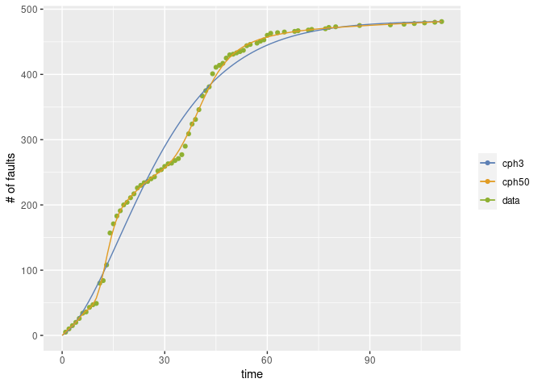

<!-- README.md is generated from README.Rmd. Please edit that file -->

# Rphsrm

Rphsrm provides the package to evalute the software reliability from the
fault data collected in the testing phase. Rphsrm uses two types of
data; fault-detection time data and its grouped data. The
fault-detection time data is a sequence of time intervals of fault
detection times (CPU time, etc). Also its grouped data is a sequence of
the number of detected faults for each time interval (per a working day,
per a week, etc). The reliability evaluation is based on the software
reliability growth model called PHSRM which is defined by NHPP
(non-homogeneous Poisson process) with phase-type fault-detection time
distribution.

  - Note: There are still some bugs.
  - TODO:
      - Remove a bug when the number of phases is 1 and 2.
      - Remove a bug when the data is given as time data.

## Installation

You can install Rsrat from github with:

``` r
# install.packages("devtools")
devtools::install_github("okamumu/Rphsrm")
```

## Example

This is an example of the estimation of software reliability growth
models from a fault data (tohma).

``` r
### require load librareis; Rsrat and Rphsrm
library(Rsrat)
library(Rphsrm)

### load example data
data(dacs)

### tohma is a grouped data
tohma
#>   [1]  5  5  5  5  6  8  2  7  4  2 31  4 24 49 14 12  8  9  4  7  6  9  4
#>  [24]  4  2  4  3  9  2  5  4  1  4  3  6 13 19 15  7 15 21  8  6 20 10  3
#>  [47]  3  8  5  1  2  2  2  7  2  0  2  3  2  7  3  0  1  0  1  0  0  1  1
#>  [70]  0  0  1  1  0  0  0  1  2  0  1  0  0  0  0  0  0  2  0  0  0  0  0
#>  [93]  0  0  0  1  0  0  0  1  0  0  1  0  0  1  0  0  1  0  1

### Esimate all models and select the best one in terms of AIC
(result <- fit.srm.cph(fault=tohma))
#> Error in em_cf1_emstep(res$param, data) : std::bad_alloc
#> Error in em_cf1_emstep(res$param, data) : std::bad_alloc
#> Model name: cphsrm10
#> [1]  481.4
#>  [1]  5.417e-01  2.451e-09  6.283e-17  1.631e-10  4.072e-01  8.353e-06
#>  [7]  3.749e-12  4.909e-11  2.505e-02  2.604e-02
#>  [1]  0.09431  0.16563  0.16583  0.16616  0.42404  0.42404  0.42404
#>  [8]  0.42404  0.45954  0.45969
#> Maximum LLF: -283.9308 
#> AIC: 607.8617 
#> Convergence: TRUE

### Draw the graph 
mvfplot(fault=tohma, mvf=list(result$srm))
```


The second example illustrates the estimation for the model with
user-specified phases

``` r
### Estimate two models and no select
(result <- fit.srm.cph(fault=tohma, phase=c(3, 50), selection=NULL))
#> Warning in emfit(srm, data, initialize = TRUE, maxiter = con$maxiter,
#> reltol = con$reltol, : LLF becomes +-Inf, NaN or NA: cphsrm50 25
#> $cphsrm3
#> Model name: cphsrm3
#> [1]  482.3
#> [1]  0.55974  0.36157  0.07869
#> [1]  0.08350  0.08619  0.08638
#> Maximum LLF: -315.7946 
#> AIC: 643.5892 
#> Convergence: TRUE 
#> 
#> 
#> $cphsrm50
#> Model name: cphsrm50
#> [1]  483.8
#>  [1]  0.039156  0.019239  0.031298  0.051663  0.073167  0.083828  0.076040
#>  [8]  0.055419  0.034226  0.019630  0.011694  0.007944  0.006394  0.005972
#> [15]  0.006156  0.006676  0.007416  0.008411  0.009866  0.012170  0.015872
#> [22]  0.021548  0.029377  0.038417  0.046184  0.049483  0.046463  0.038109
#> [29]  0.027578  0.018045  0.011124  0.006850  0.004522  0.003421  0.003082
#> [36]  0.003281  0.003920  0.004874  0.005872  0.006538  0.006623  0.006191
#> [43]  0.005538  0.004942  0.004539  0.004333  0.004257  0.004235  0.004218
#> [50]  0.004199
#>  [1]  0.03515  0.11367  0.22200  0.31245  0.37953  0.42405  0.45342
#>  [8]  0.47729  0.50297  0.53396  0.57075  0.61245  0.65788  0.70595
#> [15]  0.75581  0.80686  0.85878  0.91159  0.96570  1.02183  1.08081
#> [22]  1.14312  1.20800  1.27276  1.33322  1.38571  1.42927  1.46595
#> [29]  1.49938  1.53292  1.56868  1.60751  1.64944  1.69413  1.74120
#> [36]  1.79022  1.84076  1.89218  1.94367  1.99443  2.04405  2.09270
#> [43]  2.14088  2.18911  2.23771  2.28673  2.33607  2.38554  2.43503
#> [50]  2.48453
#> Maximum LLF: -233.2836 
#> AIC: 666.5673 
#> Convergence: FALSE

### Draw the graph
mvfplot(fault=tohma, mvf=lapply(result, function(m) m$srm))
```



The third example shows the case where the fault data are fault
detection data.

``` r
### fault-detection time data
#### Time intervals for all faults
#### The last value is a negative value, that indicates the time interval in which there is no fault detection after the last fault detection.
sys1
#>   [1]     3    30   113    81   115     9     2    91   112    15   138
#>  [12]    50    77    24   108    88   670   120    26   114   325    55
#>  [23]   242    68   422   180    10  1146   600    15    36     4     0
#>  [34]     8   227    65   176    58   457   300    97   263   452   255
#>  [45]   197   193     6    79   816  1351   148    21   233   134   357
#>  [56]   193   236    31   369   748     0   232   330   365  1222   543
#>  [67]    10    16   529   379    44   129   810   290   300   529   281
#>  [78]   160   828  1011   445   296  1755  1064  1783   860   983   707
#>  [89]    33   868   724  2323  2930  1461   843    12   261  1800   865
#> [100]  1435    30   143   108     0  3110  1247   943   700   875   245
#> [111]   729  1897   447   386   446   122   990   948  1082    22    75
#> [122]   482  5509   100    10  1071   371   790  6150  3321  1045   648
#> [133]  5485  1160  1864  4116 -2526

### Esimate
(result <- fit.srm.cph(time=sys1[sys1>=0], te=-sys1[sys1<0]))
#> Model name: cphsrm2
#> [1]  145
#> [1]  0.8891  0.1109
#> [1]  0.0000294  0.0013082
#> Maximum LLF: -968.369 
#> AIC: 1944.738 
#> Convergence: TRUE

### Draw the graph
mvfplot(time=sys1[sys1>=0], te=-sys1[sys1<0], mvf=list(result$srm))
```


The fourth example illustrates the case where the mvfs for all the
models are drawn.

``` r
### Esimate and return all the estimated results
(result <- fit.srm.cph(fault=sys1g, selection=NULL))
#> $cphsrm2
#> Model name: cphsrm2
#> [1]  496.5
#> [1]  0.96253  0.03747
#> [1]  0.009743  0.010852
#> Maximum LLF: -180.7335 
#> AIC: 369.4671 
#> Convergence: TRUE 
#> 
#> 
#> $cphsrm3
#> Model name: cphsrm3
#> [1]  239.8
#> [1]  9.574e-01  7.648e-06  4.258e-02
#> [1]  0.02801  0.02813  0.03463
#> Maximum LLF: -178.1893 
#> AIC: 368.3787 
#> Convergence: TRUE 
#> 
#> 
#> $cphsrm4
#> Model name: cphsrm4
#> [1]  195.1
#> [1]  0.9384168  0.0005967  0.0057106  0.0552758
#> [1]  0.04810  0.04810  0.04821  0.04821
#> Maximum LLF: -176.9362 
#> AIC: 369.8724 
#> Convergence: TRUE 
#> 
#> 
#> $cphsrm5
#> Model name: cphsrm5
#> [1]  180.7
#> [1]  9.008e-01  9.162e-05  3.124e-04  6.259e-02  3.623e-02
#> [1]  0.06235  0.06235  0.06236  0.06505  0.06505
#> Maximum LLF: -176.0024 
#> AIC: 372.0048 
#> Convergence: TRUE 
#> 
#> 
#> $cphsrm6
#> Model name: cphsrm6
#> [1]  174.4
#> [1]  8.719e-01  2.802e-08  5.773e-13  1.018e-01  7.266e-06  2.627e-02
#> [1]  0.06353  0.06353  0.06353  0.09615  0.09615  0.10366
#> Maximum LLF: -174.8968 
#> AIC: 373.7937 
#> Convergence: TRUE 
#> 
#> 
#> $cphsrm7
#> Model name: cphsrm7
#> [1]  165.9
#> [1]  8.623e-01  3.544e-05  7.680e-10  1.040e-07  1.167e-01  1.039e-15
#> [7]  2.097e-02
#> [1]  0.08329  0.08329  0.08329  0.08329  0.10561  0.10561  0.12893
#> Maximum LLF: -173.5188 
#> AIC: 375.0376 
#> Convergence: TRUE 
#> 
#> 
#> $cphsrm8
#> Model name: cphsrm8
#> [1]  160.1
#> [1]  8.486e-01  4.656e-08  8.952e-17  3.093e-16  3.167e-03  1.282e-01
#> [7]  1.002e-49  2.002e-02
#> [1]  0.1056  0.1056  0.1056  0.1056  0.1067  0.1091  0.1091  0.1355
#> Maximum LLF: -172.419 
#> AIC: 376.838 
#> Convergence: TRUE 
#> 
#> 
#> $cphsrm9
#> Model name: cphsrm9
#> [1]  159.3
#> [1]   8.459e-01   8.730e-16   6.412e-37   5.028e-42   2.288e-22   1.417e-01
#> [7]   1.282e-57  5.011e-224   1.242e-02
#> [1]  0.1046  0.1046  0.1046  0.1046  0.1046  0.1263  0.1263  0.1263  0.7854
#> Maximum LLF: -170.6897 
#> AIC: 377.3794 
#> Convergence: TRUE 
#> 
#> 
#> $cphsrm10
#> Model name: cphsrm10
#> [1]  157
#>  [1]   8.421e-01   1.968e-31   4.432e-51   1.097e-45   1.828e-38
#>  [6]   1.451e-01   5.852e-05  3.742e-204  4.941e-324   1.272e-02
#>  [1]  0.1044  0.1044  0.1044  0.1044  0.1044  0.1721  0.1721  0.1721
#>  [9]  0.1721  0.9233
#> Maximum LLF: -169.5053 
#> AIC: 379.0107 
#> Convergence: TRUE

### Draw the graph
mvfplot(fault=sys1g, mvf=lapply(result, function(x) x$srm))
#> Warning: Removed 1 rows containing missing values (geom_path).

#> Warning: Removed 1 rows containing missing values (geom_path).
```


